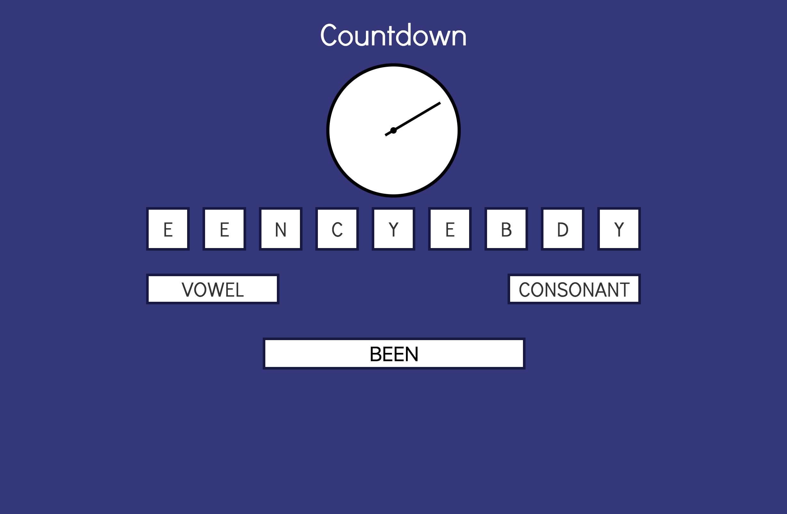

# Erste Übungsaufgabe: Countdown

*Countdown* ist eine [TV-Sendung](https://en.wikipedia.org/wiki/Countdown_(game_show)), die seit 1982 im britischen Fernsehen ausgestrahlt wird. In dieser Spielshow treten zwei Spieler in verschiedenen Runden gegeneinander an. Eine der gespielten Runden ist das sogenannten *Letters Game*, in dem die Teilnehmer in 30 Sekunden ein möglichst langes Wort aus neun, zufällig ausgewählten Buchstaben bilden müssen. In dieser Aufgabe sollen Sie dieses Spiel als Javascript-Anwendung für einen Spieler im Browser umsetzen. 

**Abgabetermin ist der 10. Juni 2019.** Wir bewerten den letzten *Commit*, der an diesem Abgabetag in das *Repository* *gepusht* wird. Informationen zur Nutzung von *Github* finden Sie im GRIPS-Kurs.

Bei Fragen zur Übungsaufgabe können Sie in das [GRIPS-Forum](https://elearning.uni-regensburg.de/mod/forum/view.php?id=1098788) *posten* oder diese per Mail (mi.mme@mailman.uni-regensburg.de) stellen.

!!! danger "Github Classroom"
	Das Starterpaket wird über *Github Classroom* bereitgestellt. Sie implementieren Ihre Lösung über ein *Repository* auf *Github*. **Das Repository, mit einer Kopie des Starterpaket, können Sie über diesen [Link](https://classroom.github.com/a/OTE0B3yP) generieren und anschließend mit der Arbeit an der Aufgabe beginnen.** Klone Sie das erstellte *Repository* dazu auf Ihren Rechner, die notwendigen Rechte für Ihr *Github*-Konto werden automatisch beim Erstellen des *Repository* gesetzt. Denken Sie daran, Ihre Arbeit an der Aufgabe durch regelmäßiges *Commiten* der Änderungen und Ergänzungen zu dokumentieren. Laden Sie Ihren aktuellen Stand reglmäßig auf *Github* hoch (*Push* bzw. im *Github Desktop*-Client über den *Sync*-Befehl. 

## Vorgaben
**Die Aufgabe beschränkt sich auf die Implementierung der Programmlogik mit Javascript. Sie müssen keine Änderungen am vorgegebenen CSS-Dokument oder der HTML-Datei vornehmen. Erweitern Sie den bereits vorhanden Javascript-Code und ergänzen Sie neue Module zur sinnvollen Gestaltung und Strukturierung der Anwendung.** Verwenden Sie dazu die im Kurs besprochene [Modul-API (ES6)](../../MME/closures-and-module-pattern/#module-in-modernen-browsern-es6-module). Die `init`-Methode in der Datei `index.js` stellt den Einstiegspunkt in die Anwendung dar. Erstellen Sie selbstständig weitere Module für die notwendigen Komponenten der Anwendung. Achten Sie dabei darauf, die unterschiedlichen Aufgaben dieser Komponenten klar voneinander abzugrenzen. Nutzen Sie wenn möglich *Event*-basierte Kommunikationswege und verwenden Sie das vorhanden Modul aus `index.js` als zentrale Schnittstelle zwischen den übrigen Modulen.

Erstellen Sie für jedes neue Modul eine eigene Datei im Ordner `resources/js`. Verwenden Sie die dortigen Unterordner zur übersichtlichen Strukturierung der Komponenten.

**Formatierung und ESLint:** 
Sie finden im Starterprojekt bereits Dateien mit Formatvorgaben für [JS-Beautify](https://github.com/beautify-web/js-beautify) bzw. Regeldateien für [ESLint](http://eslint.org/). Ihr eingereichter Programmcode darf bei Überprüfung gegen die ESLint-Datei keine Fehler erzeugen. 

Screenshot des Menübildschirms

## Bewertungskriterien

Die allgemeinen Bewertungskriterien finden Sie [hier](index.md). Zusätzlich gelten für diese Aufgabe die folgenden Punkte:

* Wurde auf eine inhaltliche und strukturelle Trennung der einzelnen Komponenten geachtet? Wurde der Modulmechanismus sinnvoll für die Ausgestaltung dieser Aufteilung verwendet?
* Sind die einzelnen Komponenten der Anwendung entlang des MVC- oder MVP-Musters entworfen und implementiert worden?
* Wurde (im Rahmen der Aufgabenstellung) auf eine gute Bedienbarkeit der Anwendung geachtet?
* Wurden alle, unter dem Punkt [Spielbeschreibung](#spielbeschreibung-und-regeln) notierten Anforderungen erfüllt?

Eine eigenständige Erweiterung der Aufgabenstellung ist nicht notwendig. Unabhängig davon können Sie natürlich gerne eigene *Features*, Verbesserungsvorschläge oder andere Inhalte ergänzen. Kennzeichnen Sie diese Änderungen bitte im Code.

## Spielbeschreibung und -regeln
Zu Beginn des Spiels wird der Menübildschirm (`#menu-screen`) eingeblendet. Ein Klick auf den Button mit der Beschriftung *Start Game* schließt den Menübildschirm und startet das eigentliche Spiel:

1. Über die beiden Buttons (`.add-vowel` und `.add-consonant`) kann der Spieler neun zufällige Buchstaben auswählen. Dabei wird beim Betätigen des *Vowel*-Buttons ein Vokal und beim Betätigen des *Consonant*-Buttons ein Konsonant ausgewählt.
2. Die ausgewählten Buchstaben werden im entsprechenden Element (`#letters`) angezeigt. Verwenden Sie für die einzelnen Buchstaben die bereits angelegten ``-Elemente in diesem Elternelement. Entfernen Sie die CSS-Klasse `empty` aus den Elementen sobald ein Buchstabe eingetragen wird. Die Buchstabenanzeige wird von links nach rechts befüllt.
3. Sobald neun Buchstaben ausgewählt wurden, startet ein *Timeout* von 30 Sekunden. In dieser Zeit soll der Sekundenzeiger der Uhr animiert werden.
4. Der Spieler versucht ein Wort aus den neun Buchstaben zu erstellen und gibt seinen Vorschlag in das Eingabefeld (`.word-input`) ein. Es dürfen nur die neun ausgewählten Buchstaben verwendet werden. Jeder der ausgewählten Buchstaben darf nur einmal verwendet werden. Nach Ablauf der 30 Sekunden ist keine Eingabe mehr möglich.
5. Nach den 30 Sekunden wird das vom Spieler eingegebene Wort überprüft. Wurde ein korrektes Wort der englischen Sprache eingegeben erhält der Spieler einen Punkt für jedes Zeichen in seinem Lösungswort. Für ein Wort mit allen neun Zeichen erhält der Spieler 18 Punkte. Wurde kein valides Wort eingegeben erhält der Spieler keine Punkte.
6. Die Punkte werden zusammen mit etwaigen Hinweisen angezeigt (siehe unten).
7. Nach 3 Sekunden wird erneut der Menübildschirm eingeblendet, über den das Starten eines weiteren Spiels möglich ist. Beim Neustart wird das Spiel auf den initialen Zustand zurückgesetzt.

**Hinweis:** In der TV-Vorlage wird der Stapel an Buchstaben, aus denen die zufälligen neun Buchstaben gewählt werden, unter Berücksichtigung der [Vorkommenshäufigkeit der Zeichen in der englischen Sprache](https://en.wikipedia.org/wiki/Letter_frequency#Relative_frequencies_of_letters_in_the_English_language) zusammensetzt und gemischt. Das heißt, dass im Ausgangsstapel ein `e` z.B. wesentlich häufiger vorkommt als ein `x` oder ein `z`. Beim Lösen der Aufgabe müssen Sie diesen Teil des Originalspiels nicht beachten und können von einer statistischen Gleichverteilung der Wahrscheinlichkeiten ausgehen. Wenn Sie die Vorkommenshäufigkeit trotzdem berücksichtigen wollen, können Sie sich an dem oben verlinkten Wikipediaartikel orientieren. Als zusätzliche, nicht bewertete, Erweiterung können Sie einmal *gezogene* Buchstaben für die aktuelle Runde aus dem fiktiven Stapel entfernen.

Screenshot der finalen Anwendung während der Auswahl der Buchstaben

## Animation der Uhr
Die durch HTML-Elemente dargestellte und über CSS gestaltete Uhr kann animiert werden. Dabei wird der Sekundenzeiger kontinuierlich innerhalb von jeweils einer Minute einmal um dessen eigene Achse rotiert (0° bis 360°). In der mitgelieferten CSS-Datei finden Sie eine definierte CSS-Regel `.hand-animated` mit allen benötigten Eigenschaften. Durch Hinzufügen dieser Regel zum `class`-Attribut des Sekundenzeiger-Elements (`.clock .hand`) starten Sie die Animation des Uhrzeigers. Wenn die Klasse wieder entfernt wird, setzen Sie damit die Position des Uhrzeigers zurück und beenden die Animation.

Screenshot der finalen Anwendung während des Spiels

## Validierung der erstellten Wörter
Sie müssen die - englischsprachige - Eingabe des Spieler validieren, um festzustellen, wie viele Punkte der Nutzer in der aktuellen Runde erhält. Verwenden Sie dazu das vorgegeben Modul aus der Datei `js/resources/wiktionary/Wiktionary.js`. Die Verwendung des Moduls ist in der Datei beschrieben. Für die Überprüfung ist eine aktive Internetverbindung notwendig. Mit Hilfe des Moduls kann geprüft werden, ob ein beliebiges Wort im [Wiktionary](https://en.wiktionary.org/wiki/Wiktionary:Main_Page) vorkommt. 

## Hinweise

In der Datei `resources/js/utils/Config.js` finden Sie ein importierbares Konfigurationsobjekt, das Sie erweitern und in Ihrer Anwendung verwenden können. Im selben Ordner findet sich in der Datei `Observable.js` eine exemplarische Implementierung einer *Observable*-Komponente, die Sie ebenfalls in Ihre Anwendung integrieren können.