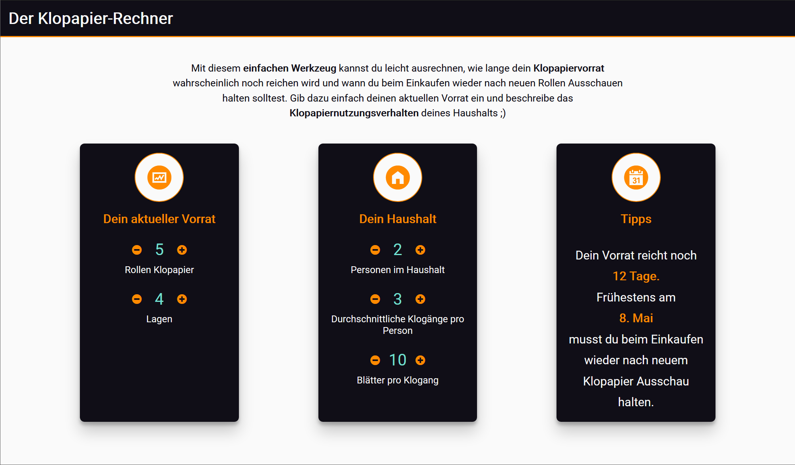

# Erste Übungsaufgabe: Der Klopapier-Rechner

Sie entwickeln eine Anwendung, die Nutzern und Nutzerinnen erlaubt, den eigenen Vorrat an Toilettenpapier besser einschätzen zu können. Dazu werden verschiedene Informationen über die Anzahl und Beschaffenheit der vorhandenen Toilettenpapierrollen und die Größe und das Verhalten des Haushalts eingegeben. Aus den Angaben schätzt die Anwendung, wie viele Tage der Vorrat noch reichen wird und gibt eine Empfehlung, wann neues Klopapier eingekauft werden sollte.

Screenshot der fertigen Anwendung

**Abgabetermin ist der 10. Mai 2020.** Wir bewerten den letzten *Commit*, der an diesem Abgabetag in das *Repository* *gepusht* wird. Informationen zur Nutzung von *Github* finden Sie im GRIPS-Kurs. Bei Fragen zur Übungsaufgabe können Sie uns im Chat erreichen, in das [GRIPS-Forum](https://elearning.uni-regensburg.de/course/view.php?id=40901) *posten* oder per Mail (mi.mme@mailman.uni-regensburg.de) Kontakt mit uns aufnehmen.

!!! danger "Github Classroom"
	Das Starterpaket wird über *Github Classroom* bereitgestellt. Sie implementieren Ihre Lösung über ein *Repository* auf *Github*. **Das Repository, mit einer Kopie des Starterpaket, können Sie über diesen [Link](https://classroom.github.com/a/_rLJstTz) generieren und anschließend mit der Arbeit an der Aufgabe beginnen.**  Stellen Sie vor dem Import des Repositorys sicher, dass wir Ihren Github-Nutzernamen eindeutig Ihrer Person zuordnen können. Klonen Sie das erstellte *Repository*  auf Ihren Rechner. Die notwendigen Rechte für Ihr *Github*-Konto werden automatisch beim Erstellen des *Repository* gesetzt. Denken Sie daran, Ihre Arbeit an der Aufgabe durch regelmäßiges *Commiten* der Änderungen und Ergänzungen zu dokumentieren. Laden Sie Ihren aktuellen Stand reglmäßig auf *Github* hoch (*Push*). 

## Vorgaben 

Im Starterpaket finden Sie eine nahezu vollständiges HTML-Dokument. Eine passende CSS-Datei für die Aufgabe ist vorhanden und mit dem HTML-Dokument verknüpft. Ebenfalls vorhanden ist eine JavaScript-Datei (`resources/js/index.js`), die in der HTML-Datei aufgerufen wird. In der `init`-Funktion können Sie mit der Arbeit am Quellcode beginnen. Verwenden Sie weitere JavaScript-Dateien, um Ihren Code zu strukturieren. Denken Sie daran, diese dann ebenfalls über die HTML-Datei einzubinden.

## Anforderungen

- NutzerInnen können die **Anzahl der Toilettenpapierrollen**, die Anzahl der **Lagen des Papiers**, die **Anzahl der Personen im Haushalt**, die durchschnittliche **Anzahl der Toilettengänge pro Person** und den durchschnittlichen **Verbrauch an Blättern pro Toilettengang** über geeignete Eingabeelemente angeben. Die Änderungen an den Werten erfolgt über die *Plus*- bzw. *Minus*-Buttons. Die aktuell ausgewählten Werte werden im UI angezeigt und dort bei Änderungen direkt angepasst.

- Die Anwendung berechnet daraus die Anzahl der Tage, die dieser Vorrat noch reichen wird und gibt eine Empfehlung, wann neues Papier besorgt werden sollte. Für diese Empfehlung wird ein Datum berechnet, das **3 Tage** vor dem geschätzten Aufbrauchen des aktuellen Vorrats liegt. Die Ausgabe erfolgt als Text im HTML-Element mit der Klasse `result-text`. Ein Beispiel für einen solchen Text finden Sie im Screenshot zu dieser Aufgabe. Bei jeder Änderung der Eingabewerte wird der Text neu generiert und im *User Interface* aktualisiert.

- Bei der Berechnung können Sie davon ausgehen, dass eine Rolle dreilagiges Toilettenpapier ca. 200 Blatt hat, bei vierlagiges Toilettenpapier sind es etwa 150 Blatt.

- Achten Sie auf eine hohe Codequalität. Verwenden Sie passende und verständliche Bezeichner. Kommentieren Sie Ihren Code dort wo nötig. Trennen Sie die verschiedenen Aufgabenbereiche Ihrer Anwendung voneinander und nutzen Sie dazu z.B. unterschiedliche JavaScript-Dateien. Verwenden Sie den [Klassen-Syntax](https://developer.mozilla.org/en-US/docs/Web/JavaScript/Reference/Classes)[^1] um Prototypen für häufiger verwendete Komponenten oder größere Teilbereiche Ihrer Anwendung zu erstellen.

- Nutzen Sie das Feedback von ESLint, um direkt und gezielt problematische Stellen im Code auszubessern. Eine entsprechende Konfigurationsdatei ist im Starterpaket vorhanden. Ihr Code sollte bei Abgabe keinerlei Warnungen oder Fehler mehr enthalten. Auch wenn das in der ersten Studienleistung noch kein Ausschlusskriterium ist, werden wir das bereits bei dieser Aufgabe automatisch testen.

## Weitere Hinweise zum Vorgehen

- Beginnen Sie damit, die Änderungen an den Eingabewerten zu implementieren. Greifen Sie dazu auf die *Click*-Events der entsprechenden Schaltflächen zurück und nutzen Sie diese um den angezeigten Wert zwischen den Schaltflächen zu verändern. Überlegen Sie sich, wie Sie diese Aufgabe einheitlich und am besten wiederverwendbar für alle notwendigen Schaltflächen umsetzen können.

- Im Startercode sind nicht alle notwendigen Eingabefelder für die Umsetzung der Aufgabe vorhanden. Ergänzen Sie diese, in dem Sie die vorhandenen Elemente verwenden und an die entsprechenden Stellen im HTML-Dokument kopieren.

- Lagern Sie die Berechnungen und die Erstellung des Infotexts in einen separaten Bereich Ihre Anwendung aus. Verknüpfen Sie die Änderungen an den Eingabewerden mit der Generierung und Darstellung des Infotexts.

- Erstellen Sie in einem ersten Schritt eine funktionierende aber qualitativ noch nicht ausgereifte Version der Anwendung und verbessern Sie diese konsequent.

[^1]: JavaScript ist eine Prototypen-basierte, objekt-orientiere Programmiersprache. Klassen, so wie wir Sie aus z.B. Java kennen gibt es nicht. Der mit [ECMAScript6](http://www.ecma-international.org/ecma-262/6.0/) eingeführte Syntax ist "nur" [syntaktischer Zucker](https://en.wikipedia.org/wiki/Syntactic_sugar) der ProgrammiererInnen mit entsprechenden Vorerfahrungen in anderen Sprachen den Einstieg in die prototypische Objektorientierung erleichtern soll. Sie könne und sollten diese *Schreibweise* auch in diesem Kurs verwenden.
