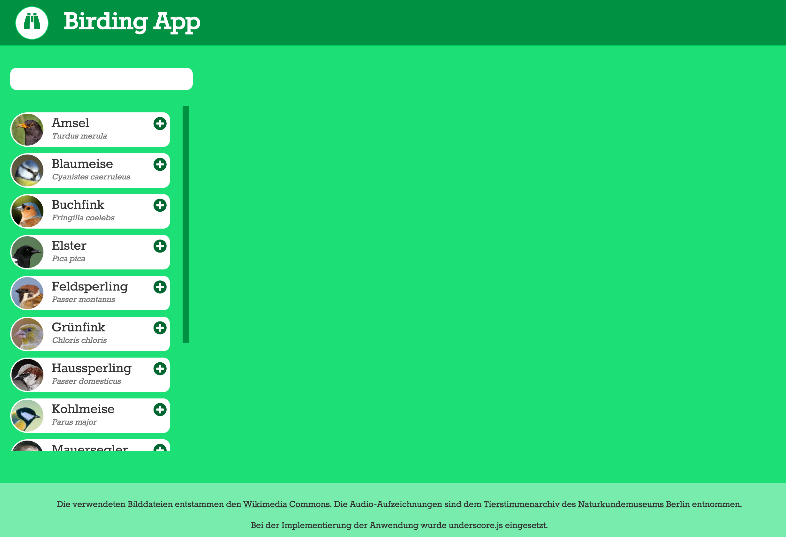

# Zweite Übungsaufgabe: Birding App

 Vom 8. bis 10. Mai fand die jährliche _Stunde der Gartenvögel_ statt. Bei [dieser Aktion](https://www.nabu.de/tiere-und-pflanzen/aktionen-und-projekte/stunde-der-gartenvoegel/index.html) des [NABU](https://www.nabu.de/) und des [LBV](https://www.lbv.de/) werden deutschlandweit Statistiken zur Populationsgröße heimischer Vogelarten erhoben. In dieser Aufgabe implementieren Sie eine Webanwendung, die ornithologisch begeisterten NutzerInnen die Teilnahme an der nächsten Vogelzählung erleichtern wird. Die Anwendung stellt 15 der häufigsten heimischen Vogelarten in einer durchsuchbaren Liste dar und erlaubt das Zählen einzelner Exemplare.



<div class="img-label">Screenshot der fertigen Anwendung</div>

**Abgabetermin ist der 24. Mai 2020.** Wir bewerten den letzten *Commit*, der an diesem Abgabetag in das *Repository* *gepusht* wird. Informationen zur Nutzung von *Github* finden Sie im GRIPS-Kurs. Bei Fragen zur Übungsaufgabe können Sie uns im Chat erreichen, in das [GRIPS-Forum](https://elearning.uni-regensburg.de/course/view.php?id=40901) *posten* oder per Mail (mi.mme@mailman.uni-regensburg.de) Kontakt mit uns aufnehmen.

!!! danger "Github Classroom"
    Das Starterpaket wird über *Github Classroom* bereitgestellt. Sie implementieren Ihre Lösung über ein *Repository* auf *Github*. **Das Repository, mit einer Kopie des Starterpaket, können Sie über diesen [Link](https://classroom.github.com/a/-ZNo_ki3) generieren und anschließend mit der Arbeit an der Aufgabe beginnen.**  Stellen Sie vor dem Import des Repositorys sicher, dass wir Ihren Github-Nutzernamen eindeutig Ihrer Person zuordnen können. Klonen Sie das erstellte *Repository*  auf Ihren Rechner. Die notwendigen Rechte für Ihr *Github*-Konto werden automatisch beim Erstellen des *Repository* gesetzt. Denken Sie daran, Ihre Arbeit an der Aufgabe durch regelmäßiges *Commiten* der Änderungen und Ergänzungen zu dokumentieren. Laden Sie Ihren aktuellen Stand reglmäßig auf *Github* hoch (*Push*). 

**Ein kurzes Video der finalen Anwendung sehen Sie hier:**


## Vorgaben 

Im Starterpaket finden Sie ein vollständiges HTML-Dokument. Eine passende CSS-Datei für die Aufgabe ist vorhanden und mit dem HTML-Dokument verknüpft. Ebenfalls vorhanden ist eine JavaScript-Datei (`resources/js/index.js`), die in der HTML-Datei aufgerufen wird. In der `init`-Funktion können Sie mit der Arbeit am Quellcode beginnen. Verwenden Sie weitere JavaScript-Dateien, um Ihren Code zu strukturieren. Denken Sie daran, diese dann ebenfalls über die HTML-Datei einzubinden.

## Anforderungen und Anwendungsbeschreibung

Versuchen Sie die folgenden Features möglichst komplett und fehlerfrei umzusetzen. Achten Sie dabei darauf, die vorgeschlagenen Architektur und die Aufgabenverteilung bezüglich der Modulstruktur einzuhalten. Vermeiden Sie fehlerhafte Implementierungen und stellen Sie eine funktionierende Bedienung der Anwendung sicher. Denken Sie daran, dass auch die qualitative Gestaltung des Quellcodes in die Bewertung einfließt. Datengrundlage für die gesamte Anwendung ist das `JSON`-Array, dass Sie innerhalb der vorgegebenen HTML-Datei `index.html` im `script`-Tag mit der ID `bird-list` finden. In diesem Array sind unterschiedliche Vogelarten aufgeführt, die jeweils mit mehreren Informationen beschrieben werden. Ein einzelner Eintrag hat diese Form:
```
{   
    "id":1,
    "name":"Haussperling", 
    "latinName":"Passer domesticus", 
    "imagePath":"res/img/haussperling.png", 
    "audioPath":"res/audio/haussperling.ogg"
}
```

Zum Umwandeln des <i>JSON</i>-Strings in ein Javascript-Array können Sie das [JSON-Objekt](https://developer.mozilla.org/en-US/docs/Web/JavaScript/Reference/Global_Objects/JSON) der Javascript-API verwenden. Auf den Inhalt des Tags können Sie durch dessen Selektion per `document.querySelector` und die Eigenschaft `innerHTML` zugreifen. Der Pfad zur Audiodatei, die eine Tonaufnahme des Rufs des jeweiligen Vogels enthält, wird in dieser Aufgabe nicht genutzt. Die Datei kann aber für eigene Erweiterungen der Anwendung verwendet werden. Sowohl die Bild- als auch die Audiodateien finden sich im Ordner `resources/data` in der vorgegebenen Projektstruktur. 

### Allgemeine Anforderungen

- Achten Sie auf eine hohe Codequalität. Verwenden Sie passende und verständliche Bezeichner. Kommentieren Sie Ihren Code dort wo nötig. Trennen Sie die verschiedenen Aufgabenbereiche Ihrer Anwendung voneinander und nutzen Sie dazu das bekannte Modul-Konzept. Verwenden Sie den [Klassen-Syntax](https://developer.mozilla.org/en-US/docs/Web/JavaScript/Reference/Classes)[^1] um Prototypen für häufiger verwendete Komponenten oder größere Teilbereiche Ihrer Anwendung zu erstellen.
- Nutzen Sie das Feedback von ESLint, um direkt und gezielt problematische Stellen im Code auszubessern. Eine entsprechende Konfigurationsdatei ist im Starterpaket vorhanden. Ihr Code darf bei Abgabe keinerlei Warnungen oder Fehler mehr enthalten.
- Versuchen Sie Ihre Arbeit am Code best möglichst mithilfe von `git` zu dokumentieren. Fassen Sie zusammengehörige Änderungen als einzelne *Commits* zusammen und verfassen Sie sinnvolle *Commit*-Nachrichten.

### Auswahlliste mit Vogelarten

Im linken Bereich der Anwendung findet sich eine Auswahlliste (Selektor: `.bird-gallery`) aller in der App bekannten Vogelarten. Die Arten sind über ein Suchfeld oberhalb der Liste filterbar, wobei die Eingabe als Such- bzw. Filterkriterium für die Artnamen verwendet wird. Ist das Feld leer, wird die komplette Liste angezeigt. Gibt der Nutzer Text ein, wird mit jeder Änderung überprüft, ob der eingegebene String in einem der Artnamen vorkommt. Angezeigt werden dann alle Arten, auf die dieses Kriterium zutrifft. Nutzen Sie für die Darstellung der einzelnen Einträge das _Template_, das in dem `script`-Tag `bird-list-entry` bereitgestellt wird. Die Einträge werden der unsortierten Liste `ul` hinzugefügt, die Sie als Kindelement der Auswahlliste im _DOM_ finden.  

Über die Liste kann der Benutzer Vogelarten auswählen. Dazu klickt er auf das entsprechende _Plus_-Symbol des jeweiligen Listeneintrags. Die so selektierte Art wird in das _Dashboard_ aufgenommen.

### Dashboard mit beobachteten Vogelarten

Im _Dashboard_ (Selektor: `.bird-counter`) - rechts von der Auswahlliste - werden alle Vogelarten dargestellt, die bereits über die Liste ausgewählt wurden. Neue Einträge werden dem Kindelement `.bird-list` hinzugefügt. Nutzen Sie für die neuen Einträge das _Template_, das Sie im `script`-Tag mit der ID `bird-counter-entry` finden. Im _Template_ werden zwei als Interaktionselemente zu verwendende Bereiche definiert: `<span class="bird-counter-decrease button">` und `<span class="bird-counter-increase button">`. Diese dienen zum Zählen der beobachteten Vögel. Mit einem Klick auf den jeweiligen Button wird der im _Model_ gespeicherte Wert für die Anzahl der beobachteten Exemplare der jeweiligen Art verringert bzw. erhöht. Der neue Wert wird dann auch im entsprechenden _Dashboard_-Eintrag aktualisiert.

# Die HTML-Struktur der Anwendung

Die komplette HTML-Struktur sowie die notwendigen CSS-Regeln sind vorgegeben. Bei der Implementierung der Anwendung können Sie sich auf die Erstellung der notwendigen Javascript-Module konzentrieren. Um Ihnen den Aufbau der Anwendung näher zu bringen, sind im Folgenden die wichtigsten Bereiche der HTML-Struktur aufgeführt. Solange Sie die vorgegebenen [_Templates_](https://developer.mozilla.org/en-US/docs/Web/HTML/Element/template) für die Darstellung der dynamisch ergänzten _User Interface_-Elemente verwenden, müssen Sie sich über die korrekte Gestaltung keine Gedanken machen. Das heißt auch, dass Sie mögliche Darstellungsprobleme, die sich aus der korrekten Verwendung der Templates ergeben nicht korrigieren müssen.

### Auswahlliste

Die komplette Auswahlliste wird als Blockelement strukturiert und kann über das Klassenattribut `bird-gallery` identifiziert werden. Als Kindelemente werden ein Eingabefeld (`input`) sowie eine unsortierte Liste (`ul`) vorgegeben. Neue Einträge in die Liste werden als entsprechende Kinderelemente (`li`) ergänzt. Nutzen Sie dazu das vorgegebene _Template_. Jeder Eintrag verfügt dadurch über ein Element `<span class="add-bird-button">`. Ein Klick auf diesen Button fügt den so ausgewählten Eintrag zum _Dashboard_ hinzu. Zusätzlich zur Liste beinhaltet das `.bird-gallery`-Element das Eingabefeld `input`, das zum Filtern der Liste verwendet werden soll. Um auf die Nutzereingabe zu reagieren, müssen Sie ein passendes Event verarbeiten. Eine Beschreibung des Elements sowie eine Übersicht der verfügbaren Events finden Sie [hier](https://developer.mozilla.org/en-US/docs/Web/API/HTMLInputElement).

```
<div class="bird-gallery">
	<input type="text" class="bird-search" />
	<ul class="bird-list">
    </ul>
</div>
```

### Dashboard

Rechts neben der Auswahlliste befindet sich das _Dashboard_, auf dem die aus der Liste ausgewählten Vögel abgebildet werden. Der Aufbau des entsprechenden HTML-Elements entspricht grob dem der Auswahlliste. Auch hier werden die einzelnen _Einträge_ als Elemente einer unsortierten Liste dargestellt. Das Listenelement (`.bird-list`) wird von einem Blockelement (`.bird-counter`) umschlossen. Neue Elemente werden als Kinderelemente (`li`) hinzugefügt.

```
<div class="bird-counter">
	<ul class="bird-list">
    </ul>
</div>
```

# Modul-Struktur der Anwendung

Die Code-Struktur der fertigen Anwendung soll weitmöglichst dem [Separation of concerns](https://en.wikipedia.org/wiki/Separation_of_concerns)-Ansatz folgen und dabei das [model-view-controller](https://en.wikipedia.org/wiki/Model%E2%80%93view%E2%80%93controller)-Muster umsetzen. Die unterschiedlichen Aufgabenbereiche werden dabei durch separate ES6-Module abgebildet.

### BirdingApp 

*Implementieren Sie dieses Modul in der Datei `index.js`*

Dieses Modul dient als zentrale Komponente der Anwendung und steuert die übrigen Bestandteile. Das globale Objekt `BirdingApp`, in dem das Modul gespeichert wird, soll als _Namespace_ für die übrigen Module verwendet werden. Das Modul hat zwei wesentliche Aufgaben: Beim Starten der Anwendung werden hier die weiteren Module initialisiert. Dazu wird die `init`-Methode des Moduls aufgerufen. Zur Laufzeit steuert das Modul die Kommunikation zwischen den übrigen Programmbestandteilen. Diese sind im Optimalfall unabhängig voneinander und geben nötige Informationen an das zentrale Modul weiter bzw. werden von diesem informiert und gesteuert. Sollten andere Module Zugriff auf DOM-Elemente benötigen, können Sie diese Elemente bereits hier aus dem DOM selektieren und dann als Referenz weitergeben, um so die Gesamtstruktur der HTML-Komponenten der Anwendung bestmöglich zu schützen.

### BirdingModel

*Implementieren Sie dieses Modul z.B. in der Datei `BirdingModel.js`*

Das Model der Anwendung speichert den aktuellen Zustand der App. Hier wird die Liste der verfügbaren Vogelarten gespeichert und bereit gestellt. Andere Komponenten können mit dem Model über ein öffentliches Interface kommunizieren:

  * Das Model stellt eine Liste der vorhanden Vogelarten bereit
  * Das Model stellt eine anhand eines übergebenen Suchstrings gefilterte Teilliste der Vogelarten bereit. Zurückgegeben werden alle Arten, deren (deutscher) Name den Suchstring enthält.
  * Das Model stellt eine Liste der Vogelarten bereit, die bereits zum _Dashboard_ hinzugefügt wurden. Zusätzlich besteht die Möglichkeit, neue Arten in diese Liste einzutragen.
  * Das Model erlaubt das Erhöhen bzw. Verringern der Anzahl der gezählten Exemplare einer bestimmten Vogelart.

### BirdingController

*Implementieren Sie dieses Modul z.B. in der Datei `BirdingController.js`*

Der _Controller_ fängt alle relevanten Benutzerinteraktionen ab und gibt die damit verbundene Informationen weiter. Hierzu zählen die Nutzereingaben im Suchfeld, die Auswahl eines Eintrags aus der Auswahlliste sowie die Veränderung des _Counters_ der im _Dashboard_ aufgeführten Vogelarten.

### BirdCounterView

*Implementieren Sie diese Module z.B. in den Dateien `BirdCounterView.js` und `BirdListView.js`*

Die beide _Views_ der Anwendung rendern die im _Model_ gespeicherten Informationen für die Darstellung im _User Interface_. Beide Module stellen eine öffentliche Schnittstelle zur Verfügung, die es erlaubt, neue Einträge zum _View_ hinzuzufügen. Der `BirdCounterView` verfügt zusätzlich über die Möglichkeit, bereits vorhandenen Einträge zu aktualisieren. Achten Sie beim Implementieren der beiden Module darauf, möglichst keine anderen Aufgabenbereiche wie z.B. die Verarbeitung von Eingabeevents mit ein zu beziehen. Die _Views_ repräsentieren immer den aktuellen Stand der _Anwendung_, der sich aus den im Model gespeicherten Informationen ergibt.

# Externe Bibliothek: Underscore 

In die vorgegeben Projektstruktur ist die Javascript-Bibliothek [underscore.js](http://underscorejs.org/) integriert. Die dadurch bereitgestellten Methoden erleichtern viele häufige Aufgaben im Rahmen der Verwendung von Javascript. Zusätzlich bietet _underscore_ auch einen _Templating_-Mechanismus an. Dieser erlaubt die Verwendung von _Javascript Templates_ zur dynamischen Darstellung von Inhalten (_Client Side Data Binding_). Ziel ist es dabei, Platzhalter, die in die abstrakten _Template_-Darstellung ergänzt werden, durch konkrete Eigenschaften eines Javascript-Objekt zu ersetzen und dadurch ein HTML-Element zu erzeugen, das die entsprechenden Informationen aus dem Objekt im Browser anzeigt. In dieser Anwendung wird der Mechanismus genutzt, um die als JSON bzw. Javascript-Objekte gespeicherten Repräsentationen der unterschiedlichen Vogelarten in für die Darstellung im _User Interface_ geeignete _Views_ zu transformieren. Durch diesen Ansatz verstärken wir die Trennung von Struktur und Logik weiter, da auch für die erst zur Laufzeit erzeugten UI-Elemente konkrete Vorgaben hinsichtlich der Struktur (über CSS auch für das Design) gemacht werden können, ohne dass im Javascript-Teil der Anwendung ein manuelles Zusammensetzen der zur Darstellung notwendigen HTML-Strukturen notwendig ist.  

## Templating mit _underscore.js_

Der _Templating_-Prozess läuft in vier Schritten ab:

1.  **Erstellen des _Templates_:** Die zu verwendende HTML-Struktur des _Views_ wird im Vorfeld festgelegt. Alle Stellen, die später dynamisch in diese Struktur ergänzt werden sollen, werden durch Platzhalter gekennzeichnet. _Underscore_ verwendet dabei einen speziellen Syntax: die Platzhalter werden durch `<%=` und `%>` eingeschlossen. Der Inhalt zwischen diesen Markierungen wird später durch passenden Eigenschaften des jeweiligen Objekts ersetzt, das an das _Template_ gebunden wird. Ein Platzhalter `<%= name %>` wird z.B. durch die Eigenschaft `name` des verwendeten Objekts ersetzt. Über die Platzhalter lassen sich auch hierarchische Strukturen innerhalb des Objekts abbilden: `<%= address.street %>`  
    Das erstellte _Template_ muss an einem zugänglichen Ort gespeichert werden. Das kann z.B. eine externe Datei sein, die zur Laufzeit nachgeladen wird. Alternativ kann auch ein `script`-Tag in der zentralen HTML-Datei verwendet werden, dessen Inhalt durch entsprechende Javascript-Methoden ausgelesen werden kann.
2.  **Erzeugen der _Templating_-Funktion**: Damit das _Template_ genutzt werden kann, muss dieses in eine Funktion _kompiliert_ werden, die das Binden eines Objekts bzw. das Ersetzten der Platzhalter erlaubt. Die einmal erstellte _Template_-Funktion kann anschließend wiederholt genutzt werden, um unterschiedliche Objekte an das gleiche _Template_ zu binden. Die Erstellung der Funktion erfolgt über die _underscore_-Methode [`template`](http://underscorejs.org/#template). Diese erwartet einen String (Das _Template_) als Parameter. Da wir einen `script`-Tag zum Speichern des _Template_ verwenden, können Sie über Selektion des Elements (verwenden Sie das `id`-Attribut) und anschließenden Auslesens des Inhalts über die `innerHTML`-Eigenschaft an dessen Inhalt gelangen. Als Rückgabe erhalten Sie von der `template`-Funktion eine neue Funktion, die Sie für die weitere Verwendung in einer Variable abspeichern sollten.
3.  **Binden der Objekt-Daten an das _Template_:** Übergeben Sie das Objekt, mit dessen Inhalten Sie die _Template_-Platzhalter ersetzen möchten, an die im vorherigen Schritt erzeugte Funktion. Sollten Objekt und _Template_ kompatibel sein (d.h. die Platzhalter haben entsprechende Gegenparts unter den Eigenschaften des Objekts), erhalten Sie als Rückgabe einen String, der das neue HTML-Element repräsentiert. Die Rückgabe stellt aber noch kein tatsächliches HTML-Element bzw. kein entsprechendes Javascript-Objekt da.
4.  **Einfügen des neuen _Views_ in das _DOM_:** Damit Sie das Element in das _DOM_ der Anwendung integrieren können, müssen Sie aus dem generierten String ein entsprechendes HTML-Element erzeugen. Die einfachste Möglichkeit dazu ist das Erzeugen eines neuen, leeren Elements (`var element = document.createElement("div")`) als temporären Container. Der Template-String wird dem neuen Element als Inhalt hinzugefügt (`element.innerHTML = RESULT_OF_TEMPLATE_FUNCTION`). Anschließend kann das Kindelement, das das eigentlich benötigte Element darstellt, ausgelesen werden (`var newElement = element.children[0]`). Das so erzeugte Element bzw. die so erzeugten Elemente können dann über z.B. die `appendChild`-Funktion an bereits existierende HTML-Elemente angehängt werden. Am einfachsten funktioniert diese Ansatz, wenn das _Template_ auf oberster Ebene nur aus einem Element besteht.

```
<!-- Beispiel-Template aus der Aufgabenstellung -->                
<script type="text/template" id="bird-list-entry">
	<li class="bird-list-entry" bird-id="<%= id %>">
    	" class="bird-image" />
    	<div class="bird-description">
    	<!-- ... -->


/* Beispiel-Code für die Verwendung des Template-Mechanismus */

/* Selektion des Template */
var entryTemplateContent = document.querySelector("#bird-list-entry").innerHTML; 

/* Generieren der Template-Funktion */               
var createEntryTemplate = _.template(entryTemplateContent);

/* Selektion des Ziel-Elternelements */
var birdList = document.querySelector(".bird-list");

/* Erzeugen des neu hinzuzufügenden Elements */
var entryNode = document.createElement("div");
ntryNode.innerHTML = createEntryTemplate(bird);

/* Einfügen des neuen Elements */
birdList.appendChild(entryNode.children[0]);

```

## Utility-Funktionen in _underscore.js_

Neben dem _Templating_-Mechanismus ergänzt die _underscore.js Library_ den bekannten Javascript-Funktionsumfang um viele nützliche Methoden. Bei der Implementierung der Anwendung können Sie gerne von diesen Hilfsfunktionen Gebrauch machen. Die vollständige Dokumentation der verfügbaren Funktionen finden Sie auf der Projektseite. Alle Funktionen werden dabei über das Objekt `_` referenziert, das durch die Integration der Bibliothek in die eigenen Anwendung als globale Variable bereitgestellt wird. Im Kontext dieser Aufgabe sind vor allem die _underscore_-Bereiche relevant, die Sie im Umgang mit [Collections](http://underscorejs.org/#collections) (_Listen_ die als Objekte oder Arrays dargestellt werden können) unterstützen. Hier finden Sie Methoden zum Filtern, Sortieren oder _Mappen_ von Listen, die Sie z.b. für die Verarbeitung der im Model gespeicherten Artenliste verwenden können.  

Die durch _underscore_ bereitgestellte Funktionalität lässt sich natürlich auch durch eigene Implementierungen abdecken; der Einsatz der _Library_ unterstützt Sie aber beim schnellen Implementieren von übersichtlichem und fehlerfreiem Code. Ein gutes Beispiel dafür ist etwa die `findWhere`-Funktion. Diese erlaubt das gezielte Suchen nach Inhalten einer _Collection_ anhand parametrisierbarer Eigenschaften. Wenn Sie die bereitgestellte Artenliste in ein Javascript-Array überführt haben, können Sie z.B. nach Einträgen mit einer bestimmen `ID` suchen:

```
var birdWithId = _.findWhere(birdList, { id: id });
```