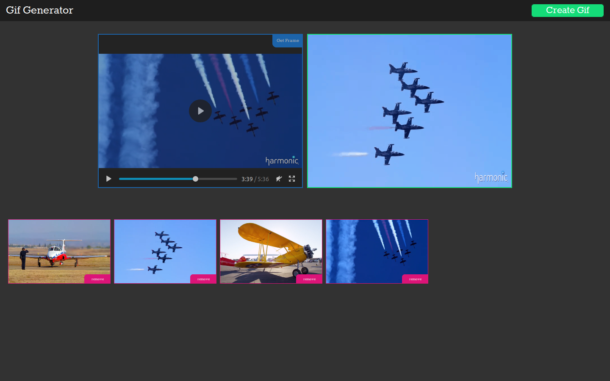

# Zweite Übungsaufgabe: GifGenerator

In dieser Aufgabe implementieren Sie eine Editor, der aus benutzerdefinierten Einzelbildern eines Videos *Animated GIFs* erzeugen kann. Der Nutzer kann Videos per *Drag & Drop* in den Browser ziehen, das im dafür vorgesehenen `video`-Element abgespielt wird. Über einen entsprechenden *Button* können Einzelbilder aus dem Video extrahiert werden. Diese *Frames* werden in einer Liste dargestellt und können individuell gelöscht und per *Drag & Drop* neu angeordnet werden. Anschließend hat der Nutzer die Möglichkeit, aus der aktuellen Reihenfolge der extrahierten Einzelbilder ein animiertes GIF zu erstellen, das nach Fertigstellung neben dem Video in einem `img`-Element angezeigt wird. 

**Lesen Sie sich zu Beginn die komplette Aufgabenstellung durch. Ihre Aufgabe beschränkt sich auf die Implementierung der Programmlogik mit Javascript. Sie müssen keine Änderungen am vorgegebenen CSS-Dokument oder der HTML-Datei vornehmen. Erweitern Sie nur den bereits vorhanden Javascript-Code. Abgabetermin ist der 23. Dezember 2019. Wir bewerten den letzten Commit, der an diesem Abgabetag in das Repository *gepusht* wird.**

Fragen zur Übungsaufgabe können Sie in das [GRIPS-Forum](https://elearning.uni-regensburg.de/mod/forum/view.php?id=1166886) *posten* oder diese per Mail (mi.mme@mailman.uni-regensburg.de) stellen.

!!! danger "Github Classroom"
	Das Starterpaket wird über *Github Classroom* bereitgestellt. Sie implementieren Ihre Lösung über ein *Repository* auf *Github*. **Das Repository, mit einer Kopie des Starterpaket, können Sie über diesen [Link](https://classroom.github.com/a/AO_54k29) generieren und anschließend mit der Arbeit an der Aufgabe beginnen.** Klonen Sie das erstellte *Repository* dazu auf Ihren Rechner. Die notwendigen Rechte für Ihr *Github*-Konto werden automatisch beim Erstellen des *Repository* gesetzt. Denken Sie daran, Ihre Arbeit an der Aufgabe durch regelmäßiges *Commiten* der Änderungen und Ergänzungen zu dokumentieren. Laden Sie Ihren aktuellen Stand reglmäßig auf *Github* hoch (*Push*). 

## Bewertungskriterien

Die allgemeinen Bewertungskriterien finden Sie [hier](index.md). Zusätzlich gelten für diese Aufgabe die folgenden Punkte:

* Wurde auf eine inhaltliche und strukturelle Trennung der einzelnen Komponenten geachtet? Wurde der Modulmechanismus sinnvoll für die Ausgestaltung dieser Aufteilung verwendet?
* Sind die einzelnen Komponenten der Anwendung entlang des MVC- oder MVP-Musters entworfen und implementiert worden?
* Wurde (im Rahmen der Aufgabenstellung) auf eine gute Bedienbarkeit der Anwendung geachtet?
* Wurden alle, unter dem Punkt [Spielbeschreibung](#aufgabenstellung) notierten Anforderungen erfüllt?

Eine eigenständige Erweiterung der Aufgabenstellung ist nicht notwendig. Unabhängig davon können Sie natürlich gerne eigene *Features*, Verbesserungsvorschläge oder andere Inhalte ergänzen. Kennzeichnen Sie diese Änderungen bitte im Code.




## Aufgabenstellung

Versuchen Sie die folgenden Features möglichst komplett und fehlerfrei umzusetzen. Achten Sie dabei darauf, die vorgeschlagenen Architektur und die Aufgabenverteilung bezüglich der Modulstruktur einzuhalten. Vermeiden Sie fehlerhafte Implementierungen und stellen Sie eine funktionierende Bedienung der Anwendung sicher. Denken Sie daran, dass auch die qualitative Gestaltung des Quellcodes in die Bewertung einfließt. 


### Import des Videos in den Browser

Per *Drag & Drop* kann der Nutzer Videodateien auf dem Video-Element ablegen, die daraufhin in diesem abgespielt werden. Nach dem erfolgreichen Import wird der Hinweistext aus- und die Schaltfläche zum Erzeugen von Einzelbildern eingeblendet. Versehen Sie das Ausgabeelement (`video-box`) mit der CSS-Klasse `playing` um die auf den Screenshots dargestellte Gestaltung zu erreichen. Es reicht, wenn Ihre Anwendung mit dem unter `videos` mitgelieferten Video `HarmonicAirshow.mp4` funktioniert.

### Export und Darstellung der Einzelbilder

Beim Betätigen des entsprechenden *Buttons* wird das aktuelle Bild des Videos extrahiert und als `image`-Element der Liste der exportierte *Frames* hinzugefügt. Die Einzelbilder werden als Listenelemente dargestellt, nutzen Sie diesen Aufbau, um die gewünschte Darstellung zu erreichen. Diese Vorlage finden Sie als *Template* auch im HTML-Code der Anwendung.

```html
<ul class="frames">
  <li draggable="true">
      
      <span class="button delete-frame">remove</span>
    </li>
</ul>
```

Über den *remove*-Button kann ein *Frame* aus der Liste entefernt werden. Sorgen Sie zusätzlich dafür, dass der Nutzer einzelne Bilder per *Drag & Drop* innerhalb der Liste verschieben kann. Dabei gilt: Wird ein *Frame* auf einen anderen geschoben, wird das Bild innerhalb der Liste vor den darunterliegenden *Frame* einsortiert.

Versuchen Sie im gesamten Im- und Export-Prozess die Größen der Video- und Einzelbilder sowie des *Gifs* einheitlich zu halten. Dadurch vermeiden Sie Probleme wie etwa verzehrte oder fehlerhafte Darstellung in der Bilderliste oder der *Gif*-Ausgabe.

### Erzeugen des *Animated GIFs*

Beim Klick auf den entsprechenden Button wird aus den Einzelbildern ein *Animated GIFs* erzeugt. Diese Funktion ist erst zugänglich, wenn mindestens zwei Einzelbilder exportiert wurden (CSS-Klasse `disabled` des Buttons). Die Reihenfolge der Einzelbilder basiert auf der Sortierung innerhalb der oben beschriebenen Liste. Wählen Sie eine sinnvolle *Frame Rate* für das GIF. Nach Fertigstellung wird das *Animated GIF* im linken Bereich der Anwendung (`gif-box`) angezeigt. Der dort angezeigte Hinweistext wird dabei deaktiviert. Nutzen Sie diesen Aufbau, um die gewünschte Darstellung zu erreichen:

```html

```

Die integrierte *gif.js*-Bibliothek generiert als Ergebniss ein  [`Blob`](https://developer.mozilla.org/en-US/docs/Web/API/Blob)-Objekt. Für die Verwendung im ``-Container können Sie dieses mithilfe der Methode [`URL.createObjectURL`](https://developer.mozilla.org/en-US/docs/Web/API/URL/createObjectURL) umwandeln.

## Vorgaben 

Die HTML-Struktur sowie eine CSS-Datei sind vorgegeben. Machen Sie sich mit beiden Punkten vertraut und versuchen Sie das auf den Screenshots zu sehenden Design korrekt umzusetzen. Beachten Sie dazu auch die Kommentare innerhalb der CSS-Datei. Für die interne Kommunikation können Sie das bereits bekannte `EventTarget`  aus dem Browserkontext verwenden. Gerne können Sie zusätzlich auch die aus der ersten Aufgabe bekannte *underscore*-Bibliothek ergänzen, um etwa *Templating* für die dynamische Generierung der notwendigen HTML-Strukturen zu verwenden. Die *Drag & Drop*-Komponente können Sie selbstständig, oder auf Basis der im Kurs vorgestellten Lösung implementieren.

Für die Generierung des *Animated GIFs* verwenden Sie bitte die *gif.js*-Bibliothek, die bereits in das Projekt eingebunden wird. Die Dokumentation zur Verwendung der Bibliothek finden Sie [hier](https://github.com/jnordberg/gif.js). Beim Erstellen des Generators müssen Sie in der Regel den vollständigen Pfad zum *Worker*-Skript angeben (Vgl. Dokumentation der Bibliothek).