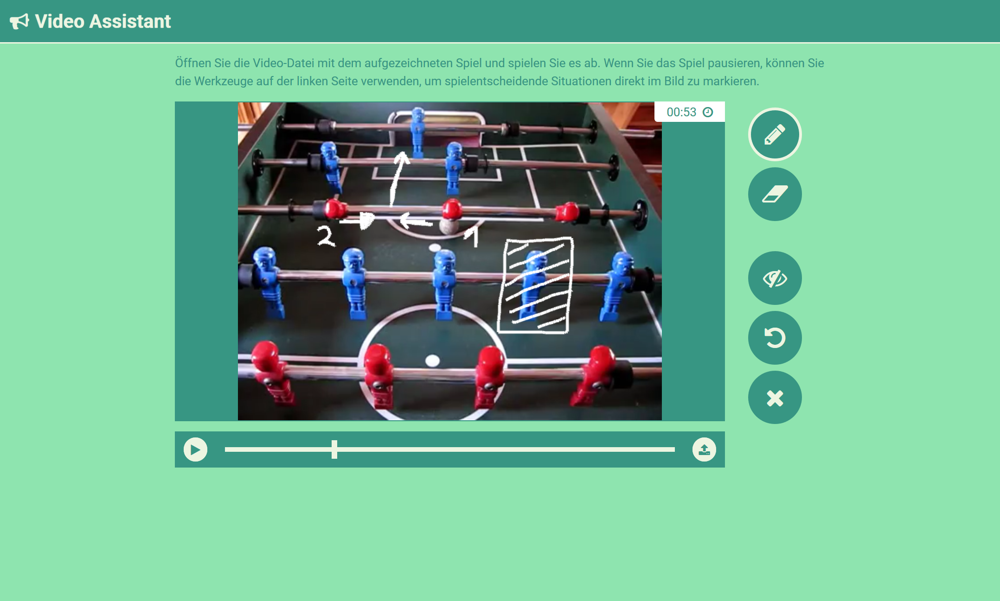

# Dritte Übungsaufgabe: Video Assistant

Im Sommer startet die [Fußball-Europameisterschaft 2020](https://de.wikipedia.org/wiki/Fu%C3%9Fball-Europameisterschaft_2020). In dieser Aufgabe entwickeln Sie dazu passend einen *Video Assistant*, mit dem aufgezeichnete Fußballspiele per Freihand-Zeichnungen kommentiert werden können. Nutzer laden dazu vorbereitete Videos in die Anwendung und können spielentscheidende Szenen auswerten und graphisch annotieren. Ein unter *Creative Commons*-Lizenz veröffentlichtes Beispielvideo finden Sie im Starterpaket im Unterordner `data`. Zum Testen Ihrer Lösung können Sie auch Video realer Spiele, z.B. von [dieser Seite](https://mediathekviewweb.de/#query=Fu%C3%9Fball%20volle%20l%C3%A4nge) verwenden.

**Abgabetermin ist der 3. Februar 2020.** Wir bewerten den letzten *Commit*, der an diesem Abgabetag in das *Repository* *gepusht* wird. Informationen zur Nutzung von *Github* finden Sie im GRIPS-Kurs und [hier](./index.md).

Fragen zur Übungsaufgabe können Sie in das [GRIPS-Forum](https://elearning.uni-regensburg.de/mod/forum/view.php?id=1166886) *posten* oder per Mail (mi.mme@mailman.uni-regensburg.de) stellen.

!!! danger "Github Classroom"
	Das Starterpaket wird über *Github Classroom* bereitgestellt. Sie implementieren Ihre Lösung über ein *Repository* auf *Github*. **Das Repository, mit einer Kopie des Starterpakets, können Sie über diesen [Link](https://classroom.github.com/a/19MXXEA4) generieren und anschließend mit der Arbeit an der Aufgabe beginnen.** Klonen Sie das erstellte *Repository* dazu auf Ihren Rechner, die notwendigen Rechte für Ihr *Github*-Konto werden automatisch beim Erstellen des *Repository* gesetzt. Denken Sie daran, Ihre Arbeit an der Aufgabe durch regelmäßiges *Committen* der Änderungen und Ergänzungen zu dokumentieren. Laden Sie Ihren aktuellen Stand regelmäßig auf *Github* hoch (*Push* bzw. im *Github Desktop*-Client über den *Sync*-Befehl). 

Screenshot des finalen Anwendung

## Vorgaben
**Die Aufgabe beschränkt sich auf die Implementierung der Programmlogik mit Javascript. Sie müssen keine Änderungen am vorgegebenen CSS-Dokument oder der HTML-Datei vornehmen. Erweitern Sie den bereits vorhanden Javascript-Code und ergänzen Sie neue Module zur sinnvollen Gestaltung und Strukturierung der Anwendung.** Verwenden Sie dazu die im Kurs besprochene [Modul-API (ES6)](../../MME/closures-and-module-pattern/#module-in-modernen-browsern-es6-module). Die `init`-Methode in der Datei `index.js` stellt den Einstiegspunkt in die Anwendung dar. Erstellen Sie selbstständig weitere Module für die notwendigen Komponenten der Anwendung. Achten Sie dabei darauf, die unterschiedlichen Aufgaben dieser Komponenten klar voneinander abzugrenzen.

Erstellen Sie für jedes neue Modul eine eigene Datei im Ordner `resources/js` und verwenden Sie geeignete Unterordner zur Strukturierung des Codes..

**Formatierung und ESLint:** 
Sie finden im Starterprojekt bereits Dateien mit Formatvorgaben für [JS-Beautify](https://github.com/beautify-web/js-beautify) bzw. Regeldateien für [ESLint](http://eslint.org/). Ihr eingereichter Programmcode darf bei Überprüfung gegen die ESLint-Datei keine Fehler erzeugen. 

<video controls>
  <source src="../videos/video-assistant-demo.mp4" type="video/mp4">
  	Ihr Browser unterstützt die Wiedergabe dieses Videos leider nicht.
</video> 

Demo-Video des finalen Anwendung

## Bewertungskriterien

Die allgemeinen Bewertungskriterien finden Sie [hier](index.md). Zusätzlich gelten für diese Aufgabe die folgenden Punkte:

* Wurde auf eine inhaltliche und strukturelle Trennung der einzelnen Komponenten geachtet? Wurde der Modulmechanismus sinnvoll für diese Aufteilung verwendet?

* Sind die einzelnen Komponenten der Anwendung entlang des MVC- oder MVP-Musters entworfen und implementiert worden?

* Wird dem Benutzer beim Anwendungsstart ein sinnvoller Initialzustand bereitgestellt? 

* Werden vorhersehbare Fehlersituationen, wie z.B. inkompatible Video-Dateien, berücksichtigt und abgefangen?

* Wurden alle funktionalen Anforderungen (Vgl. [Anforderungen](#anforderungen)) erfüllt?

Eine eigenständige Erweiterung der Aufgabenstellung ist nicht notwendig. Unabhängig davon können Sie natürlich gerne eigene *Features*, Verbesserungsvorschläge oder andere Inhalte ergänzen. Kennzeichnen Sie diese Änderungen bitte im Code.

## Anforderungen

Die von Ihnen implementierte Anwendung muss die folgenden Funkionen fehlerfrei implementieren:

1. Die Nutzer können kompatible Video-Dateien (`mp4`-Container) importieren und im *Video Player* abspielen. Über die entsprechenden Schaltflächen können sie das Video starten und pausieren und über die Zeitleiste zu beliebigen Stellen des Videos springen. Die jeweils aktuelle (zeitliche) Position des Videos wird im Format `MINUTEN:SEKUNDEN` im entsprechenden Element der Benutzeroberfläche angezeigt. Nach dem Laden eines Videos wird dieses automatisch pausiert.

2. Durch Pausieren des Videos wechselt die Anwendung in den **Annotation-Modus**. In diesem Modus kann der Nutzer das aktuell angezeigte Videobild mit Hilfe des überlagernden *Canvas* annotieren. Der **Annotation-Modus** wird durch das Fortsetzen des Videos beendet. Die erstellten Annotationen sind nur im **Annotation-Modus** sichtbar. 

3. Im **Annotation-Modus** stehen dem Benutzer unterschiedliche Werkzeuge und Aktionen zur Verfügung: 
    * Über die *Draw*-Funktion können mit Hilfe von Mausbewegungen und gedrückter Maustaste Freihandlinien gezeichnet werden.
    * Mit der *Erase*-Funktion können mit Hilfe von Mausbewegungen und gedrückter Maustaste rechteckige Bereiche der Zeichenfläche gelöscht werden.
    * Durch die *Undo*-Funktion kann die letzte, zusammenhängende Zeichen- oder Löschaktion rückgängig gemacht werden. Es können alle Aktionen seit dem letzten Starten des  **Annotation-Modus** rückgängig gemacht werden.
    * Über die *Clear*-Funktion werden alle vorhandenen Annotationen entfernt.
    * Mit der *Visibility*-Funktion können die sichtbaren Annotationen ein- bzw. ausgeblendet werden.

4. Der aktuelle Modus (*Draw* oder *Erase*) wird durch Hervorheben des entsprechenden *Icon* gekennzeichnet.

## Beschreibung des vorgegebenen UIs

In der HTML-Datei des Starterpakets sind alle notwendigen UI-Elemente vorgegeben. In der folgenden Tabelle finden Sie eine Übersicht über die intendierte Funktion der wichtigsten Elemente.

| Element | Tag/ID/Klasse | Aufgabe | Hinweise |
|---------|-----------|---------|----------|
| Player  | `#player` | Container für Videoelement und -Schaltflächen sowie den *Canvas* | - |
| Video | `video` | HTML-Videoelement zum Abspielen der Videodatei | Breite und Höhe werden, in Abhängigkeit zur Bildschirmgröße, in ein ungefähres `16:9`-Format gebracht. |
| Canvas | `canvas` | Canvas-Element für das Annotieren des darunter liegenden Videoelements | - |
| Controls | `#controls` | Container für die Schaltflächen zur Videosteuerung | Über das Hinzufügen bzw. Entfernen der Klasse `paused` zum `.play`-Element soll der aktuelle Videostatus abgebildet werden. Das `<input>`-Element zum Datei-Upload (`.upload`) ist nicht sichtbar und soll nach einem Klick auf das `.file`-Element programmatisch ausgelöst werden. |
| Menu | `#menu` | Container für die Menüelemente | Die CSS-Klasse `deactivated` bewirkt eine semi-transparente Darstellung des Menüs. Die jeweilige Bedeutung der einzelnen Schaltflächen wird durch die CSS-Klassen angegeben. Bei den  Schaltflächen zur Auswahl des Zeichenmodus kann der aktuelle Modus durch Hinzufügen der `.active`-Klasse angezeigt werden. |