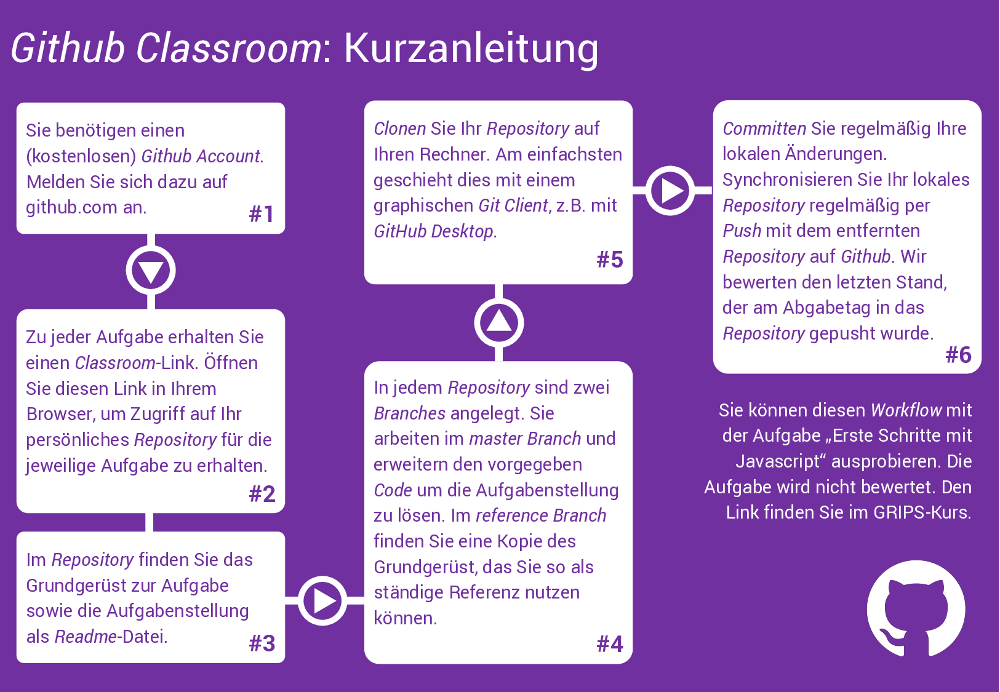

# Übungsaufgaben

Im Rahmen des Multimedia Engineering-Kurses werden semester-begleitend drei Übungsaufgaben gestellt. In jeder Übungsaufgabe werden Sie, ausgehend von einem vorgegebene Grundgerüst aus HTML und CSS eine komplexere Webanwendung implementieren. Zu jeder Aufgabe erhalten Sie ein ausführliches Handout, das Ihnen die Ziele und Bewertungskriterien erläutert. Die vorgegebenen Inhalte werden im Handout erläutert. Spezifische, nicht-funktionale Anforderungen an die zu implementierende Aufgabe, werden ebenfalls im Handout definiert. Dazu gehören z.B. bestimmte Vorgaben bezüglich der Softwarearchitektur oder des -Designs. Alle notwendigen Materialien werden über ein Github-Repository bereitgestellt und können über einen Link importiert werden. Zu diesem Zweck wird [Github Classroom](https://classroom.github.com/). Zugriff auf die von Ihnen erstellten Inhalte haben nur Sie selbst sowie Dozierende des Lehrstuhls. 

Die Bearbeitung der Übungsaufgaben ist für alle Studierenden, die ihr Medieninformatikstudium zum oder nach dem Wintersemester 2017/18 aufgenommen haben, verpflichtend (die Übungsaufgaben stellen die in der [Modulbeschreibung](https://www.uni-regensburg.de/studium/modulbeschreibungen/medien/ba/medieninformatik-ba-ws1718.pdf) vorgesehenen Studienleistungen dar). Für alle anderen Teilnehmenden ist die Bearbeitung dringend empfohlen. Eine erfolgreiche Teilnahme an den Abschlussprojekten ist ohne die Erfahrungen aus den Übungsaufgaben in der Regel nicht möglich.

## Die Aufgaben

Im **Sommersemester 2019** werden die Übungsaufgaben in den folgenden Zeiträumen bearbeitet:

- **Aufgabe 1: Countdown**: 27. Mai bis 10. Juni ([Handout](./SS19-01-Countdown))
- **Aufgabe 2**: 17. Juni bis 1. Juli (Link zu Github Classroom folgt)
- **Aufgabe 3**: 15. Juli bis 29. Juli (Link zu Github Classroom folgt)

## Anforderungen und Bewertungskriterien

Spezifische Anforderungen und Bewertungskriterien werden im Handout der jeweiligen Aufgabe erläutert. Zusätzlich werden diese allgemeinen Punkte bei der Bewertung der Aufgabe berücksichtigt:

- Mit jeder Aufgabe wird eine Konfigurationsdatei für ESLint (Vgl. [Arbeitsumgebung](../Tutorials/work-environment)) veröffentlicht. Der Code Ihrer Lösung darf keine der dort notierten Regeln verletzten.
- Der Code Ihrer Lösung muss sauber und einheitlich formatiert sein. Im Zweifelsfall halten Sie sich an die ebenfalls mit jeder Aufgabe bereitgestellte Konfigurationsdatei für *JSBeautifer*-Plugins.
- Die Qualität des Codes muss mindestens den aus OOP und Android bekannten Qualitätskriterien genügen. Dazu gehören die Verwendung sinnvoller Bezeichner, das gezielte Einsetzten bekannter Entwurfsmuster, Vermeidung bekannter *Code Smells* wie *Magic Numbers* oder *Duplicate Code* und das **sinnvolle** Kommentieren relevanter Stellen.
- Der im Handout beschrieben Funktionsumfang muss sich verlässlich und fehlerfrei nutzten lassen.

## Ablauf

1. Zu Beginn der Bearbeitungszeitraum wird hier und im GRIPS-Kurs ein Link bereitgestellt. Über diesen Link können Sie das bereitgestellte Repository mit Handout und Grundgerüst importieren. Dazu müssen Sie sich mit Ihrem Github-Account authentifizieren[^1]. Im Github-Bereich der Medieninformatik wird daraufhin eine Kopie dieses Repositorys erstellt. Sie erhalten Lese- und Schreibzugriff für dieses Repository.

2. Klonen Sie das Repository auf Ihren Rechner und beginnen Sie mit der Arbeit. Im Repository steht neben dem *Master Branch* (in dem Sie Ihre Lösung implementieren) auch ein zusätzlicher Branch * reference* bereit, in dem Sie jederzeit das ursprünglich bereitgestellte Grundgerüst einsehen können. Dokumentieren Sie Ihre Arbeit durch regelmäßige *Commits*.

3. Stellen Sie Ihre Lösung spätestens am Abgabetag bereit. *Pushen* Sie die Änderungen Ihres lokalen Repositorys dazu auf Github. Bewertet wird der jeweils letzte *Commit*, der am Abgabetag im Remote-Repository (auf Github) bereitgestellt wurde. Es empfiehlt sich, lokale Änderungen bereits während der Bearbeitung regelmäßig in das Remote-Repository zu *pushen*. Anhand der Weboberfläche von Github können Sie direkt im Browser prüfen, ob das Bereitstellen Ihrer Lösung erfolgreich war. 

Mit Hilfe [dieser Testaufgabe](https://classroom.github.com/assignment-invitations/d84cc63e1f72964722cec4f9c46a6684) können Sie den Vorgang vor der ersten Übungsaufgabe testen.

## Feedback

Sie erhalten zu jeder der Aufgaben ein ausführliches Feedback. Dieses wird direkt in dem verwendeten Repository bereitgestellt. Nach Korrektur der Aufgabe wird dort ein neuer Branch (*review*) erstellt in dem Sie allgemeines Feedback (z.B. bestanden/nicht bestanden) in Form einer Textdatei im Hauptverzeichnis des Repository finden. Der Branch enthält zusätzlich ausführliches Feedback in Form eines *Code Reviews*, das Sie in Form von Kommentaren direkt im Code Ihrer Lösung finden. Arbeiten Sie dieses Feedback in Ruhe durch und kontaktieren Sie bei Nachfragen den Dozierenden.

[^1]: Wir müssen Ihre Abgabe eindeutig Ihrer Person zuordnen können. Verwenden Sie daher entweder einen Github-Nutzernamen, der Ihren realen Namen (Vor- und Nachname) enthält oder hinterlegen Sie Ihren Realnamen in Ihrem öffentlichen Github-Profil unter "Name" (oder Sie machen beides). [Hier](https://github.com/alexanderbazo) ist ein Beispiel für ein eindeutig zuordenbares Profil. 
