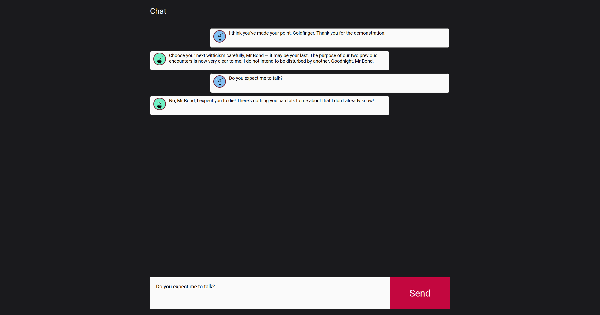

 
# Chat

In dieser Demo implementieren Sie eine einfache Chat-Anwendung. Die Applikation besteht aus einem Client, in dem Chat-Teilnehmende Nachrichten verfassen und Antworten einsehen können, sowie einer Server-Komponente, die die Client-Nachrichten an alle registrierten Teilnehmer weiterleitet. Im Vordergrund steht die exemplarische Demonstration der Einsatzmöglichkeiten von *Node.js*, insbesondere werden die Pakete `express` (für das Bereitstellen des Clients) und `websocket` (für den Datenaustausch zwischen Client und Server) vorgestellt.

!!! warning "Hinweis"
	Auch in dieser Demo steht die Implementierung einer ersten, funktionierenden Version im Vordergrund. Zahlreiche wichtige Features, wie die clientseitige Angabe des Chat-Servers oder das Speichern und Bereitstellen des Chat-Verlaufs für neue Clients, werden nicht implementiert. Diese Funktionen können aber selbständig in die hier entwickelte Lösung integriert werden. Der begrenzte Funktionsumfang der hier vorgestellten Anwendung könnten mit Hilfe der [WebRTC](https://developer.mozilla.org/en-US/docs/Web/API/WebRTC_API)-API auch ohne Server als *Peer to Peer*-Lösung implementiert werden. 

## Funktionsprinzip

Die Anwendung stellt ein maximal vereinfachtes Chat-Programm da. Beim Aufruf des Clients erfolgt automatisch die Anmeldung bei Chat-Server. Nach erfolgreicher Anmeldung wird dem Client ein anonymisiertes, zufällig generiertes Nutzerkonto zugewiesen. Dieses besteht aus einem Nutzernamen, einem Profilbild und einer eindeutigen ID. Chat-Nachrichten werden über ein Textfeld eingegeben und zusammen mit den Nutzerinformationen an den verbundenen Server übertragen. Dieser verteilt die eingegangenen Nachrichten an alle angemeldeten Nutzer (Clients). Dieser *Broadcast* wird auch an den Client zurückgesendet, der die Nachricht ursprünglich an den Server versendet hat. Jeder Client rendert die vom Server empfangenen Nachrichten im Chat-Bereich und stellt eigene und fremde Nachrichten dabei unterschiedlich dar.

### Server und Client

**Express**

Der zentrale Server der Anwendung erfüllt zwei Aufgaben. Mit Hilfe des [`express`-*Frameworks*](http://expressjs.com/) wird ein HTTP-Server erstellt, der die Client-Anwendung, bestehend aus HTML-, CSS- und Javascript-Dateien anbietet und an den Client ausliefert. Das eingesetzte *Framework* ist tendenziell für wesentlich mächtigere und umfangreichere Webanwendungen gedacht, das statische *Serving* dieser Inhalte ist einer von vielen Anwendungsfällen. Der Einsatz von `express` ist vor allem dann sinnvoll, wenn komplexere Anwendungen bereitgestellt werden oder im Rahmen der Implementierung eigene HTTP-Schnittstellen, z.B. als [Schnittstelle zu einer Datenbank](https://developer.mozilla.org/en-US/docs/Learn/Server-side/Express_Nodejs/routes), entworfen werden müssen.

**WebSocket**

Im Kontext der eigentlichen Chat-Funktionalität erfolgt die Kommunikation zwischen Server und Client über die [*WebSocket*-API](https://developer.mozilla.org/en-US/docs/Web/API/WebSockets_API). *WebSocket* ist eine HTTP-basierte Transportschicht, die für die Kommunikation textbasierter Informationen zwischen zwei Endpunkten eingesetzt werden kann. Gegenüber der klassischen HTTP-basierten Server-Client-Kommunikation (vgl. [Ajax](../MME/ajax.md)), erlauben *WebSockets* einen direkteren und performanten Datenaustausch. Dies liegt vor allem an dem einfacheren Kommunikationsaufbau, der nach Verbindung auch vom *Server* initiiert werden kann, sowie der schlankeren Paketgröße, die ohne HTTP-*Header* auskommt. Die Implementierung erfolgt auf Server- und Client-Seite durch *Callbacks*, die zentrale Phasen innerhalb der Kommunikation (Start der Verbindung, Eingang von Nachrichten sowie Verbindungsabbruch) abfangen und verarbeiten. Server und Client haben nach erfolgreicher Initialisierung der Verbindung eine dauerhafte Möglichkeit für den Austausch beliebig vieler textbasierter Nachrichten. Die *WebSocket*-API ist fester Bestandteil moderner Browser. Für die Implementierung des Servers wird die Funktionalität über das Paket `websocket` bereitgestellt.

Neben den `express` und `websocket` Pakete werden zur Implementierung des Servers einige der [eingebauten](https://nodejs.org/api/) Node.js-Module sowie - für die Generierung der zufälligen Nutzerkonten - die [AnimalAvatars](https://www.npmjs.com/package/animal-avatars.js)-Bibliothek verwendet.

**Client**

Der Client besteht aus zwei wichtigen Modulen. Im `ChatView` werden eingegebene Nachrichten des lokalen Nutzenden erkannt und weitergereicht sowie vom Server übertragene Nachrichten im DOM gerendert. Im `ChatClient` wird die Verbindung zum Chat-Server aufgebaut. Vom Server empfangene Nachrichten werden hier verarbeitet und bei Bedarf an weitere Komponenten der Anwendung weitergegeben.

## Implementierung

1. Skizzieren Sie zu Beginn den Kommunikationsprozess zwischen Client und Server. Legen Sie ein Format (*Protokoll*) fest, das die zentralen Inhalte der ausgetauschten Nachrichten festlegt. Kennzeichnen Sie verschiedene *Klassen* von Nachrichten durch eine eindeutige Bezeichnung, die später auch zur Identifikation dieser Nachrichten im Code verwendet werden kann. 

2. Mittels *WebSocket* lassen sich textbasierte Inhalte übertragen. Überlegen Sie sich eine verlustfreie Strategie zur Serialisierung und Deserialisierung der Nachrichten.

3. Beginnen Sie mit der Umsetzung des Servers. Lösen Sie zuerst das Problem, den im Ordner `www` implementierten Client über eine `express`-Anwendung bereitzustellen.

4. Ergänzen Sie serverseitig ein *ChatServer*-Modul. Beginnen Sie mit der Implementierung der *WebSocket*-Kommunikation, indem Sie einen entsprechenden Server erstellen und eine *Callback*-Methode für dessen `request`-*Event* erstellen. Dieses wird ausgelöst, wenn ein neuer Client eine Verbindung zum Server aufgebaut hat.

5. Ergänzen Sie clientseitig ein *ChatClient*-Modul für die Kommunikation mit dem Server. Implementieren Sie dieses soweit wie nötig, um die bereits vorhanden Server-Funktionalität zu testen.

6. Erweitern Sie den Server durch Vervollständigen des Anmeldevorgangs, der damit abgeschlossen wird, dass dem neuen Client ein zufälliges Nutzerkonto zugewiesen und übertragen wird. Testen Sie die Funktionalität im Client.

7. Implementieren Sie im Client das Versenden von Nachrichten. Nutzen Sie dazu das vom *ChatView* bereits versendete und in der `index.js`-Datei abgefangene `messageCreated`-Event. Sorgen Sie im Server dafür, dass empfangene Nachrichten an alle registrierten *Clients* weitergereicht werden (*Broadcasting*).

8. Schließen Sie die Implementierung damit ab, dass vom Server weitergereichte Nachrichten im *Client* gerendert werden. Im *ChatView* ist dazu bereits die Methode `createMessageElement` vorhanden, die ein passende DOM-Element zum Anzeigen einer Nachricht enthält.

## Starterpaket und Lösung

Ein vorbereitetes Starterpaket zur selbständigen Implementierung der Aufgabe sowie einen Lösungsvorschlag finden Sie auf [Github](https://github.com/Multimedia-Engineering-Regensburg-Demos/MME-Chat). Die Lösung findet sich im `master`-Branch des verlinkten Repositories. Das Starterpaket befindet sich im `starter`-Branch.