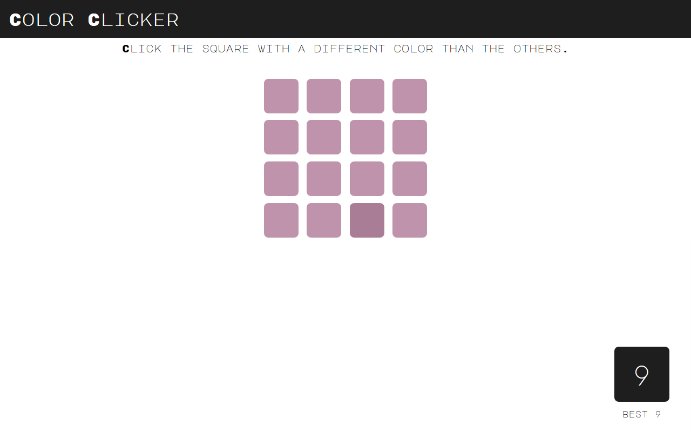

 
# Color Clicker

In dieser Aufgabe planen und implementieren Sie ein einfaches Javascript-Spiel. Es handelt sich um ein Neuimplementierung von Peter Lauris [*Color Picker*](https://gamejolt.com/games/color-picker/35110). In diesem Spiel werden dem Spieler mehrere gleichfarbige Quadrate präsentiert. Der Farbton einer der Flächen unterscheidet sich leicht gegenüber den anderen. Der Spieler muss dieses abweichende Quadrat identifizieren. Gelingt ihm dies, wird die nächste Runde gestartet, in der die Menge der Quadrate erhöht und die Farbabweichung verringert wird. Wählt der Spieler ein falsches Quadrat aus, wird das Spiel neugestartet. Farben werden als Pastellwerte im `RGB`-Raum abgebildet. Farbabweichungen werden durch die Veränderung aller drei Kanäle um den gleichen Wert berechnet.

## Aufgabenbeschreibung

Versuchen Sie in Teams von maximal drei Studierenden, eine funktionierende Lösung zu implementieren. Planen Sie zuerst Ihr Vorgehen und skizzieren Sie Architektur und Design der Anwendung. Planen Sie den Spielablauf und überlegen Sie, welche Phasen und Ereignisse diesen ausmachen bzw. beeinflussen. Nutzen Sie zur Codierung der Anwendung die [*mob programming*](https://en.wikipedia.org/wiki/Mob_programming)-Methode, eine Abwandlung des [*pair programming*](../MME/pair-programming.md).

!!! note "Vertical Slice"
	Verwenden Sie auch für diese Aufgabe die [*vertical slice*](https://en.wikipedia.org/wiki/Vertical_slice)-Methode und implementieren Sie zuerst die wesentlichen Spielfeatures, bevor Sie diese in der Breite durch Feedback-Funktionen und andere Erweiterungen ergänzen.

### Vorbereitung

Das notwendige Repository können Sie über [diesen Link](https://classroom.github.com/g/AVItOiRr) erstellen. Verwenden Sie konsequent `git` um Ihren Fortschritt zu dokumentieren. Versuchen Sie dabei, Änderungen zuerst lokal zu implementieren und nach erfolgreicher Integration in einen `dev`-*Branch* im *Remote*-Repository zu überführen. Beim Erreichen größerer Meilensteine können Sie die diesen *Branch* mit dem `master`-*Branch* *mergen*.

## Anforderungen

Die Spielablauf soll in der fertigen Anwendung den folgenden Regeln entsprechen:

- Für jede Runde wird ein *Game State* mit allen wichtigen Paramtern erstellt. Die Farbe der Quadrate wird zufällige ausgewählt. Die Anzahl der Quadrate sowie die Schwierigkeit bezüglich der Farbabweichung steigt mit jeder Runde und wird durch sinnvolle Vorgabe- und Grenzwerte kontrolliert.
- Dem Spieler werden die generierten Quadrate angezeigt. Klickt dieser auf das korrekte, abweichende Quadrate, wird die nächste Spielrunde gestartet. Wählt er das falsche Element aus, wird das Spiel auf den initialen Zustand zurückgesetzt.
- Wichtige Spielereignisse werden dem Spieler über passende Kanäle mitgeteilt.
- Der höchste jemals erreichte Level (*Highscore*) wird neben dem aktuellen *Level* im *User Interface* angezeigt. Diese Information bleibt *Session*-übergreifend erhalten.

<video controls>
  <source src="../videos/color-clicker-demo.mp4" type="video/mp4">
  	Ihr Browser unterstützt die Wiedergabe dieses Videos leider nicht.
</video> 

Video einer einfachen Implementierung des Spiels

## Vorgaben im Starterpaket

Das Starterpaket gibt nur die HTML-Struktur bzw. die Benutzeroberfläche vor. Die korrekte Anordnung der Quadrate und etwaige Feedback-Elemente müssen Sie selbstständig ergänzen.

## Starterpaket und Lösung

Ein vorbereitetes Starterpaket zur selbständigen Implementierung der Aufgabe sowie einen Lösungsvorschlag finden Sie auf [Github](https://github.com/Multimedia-Engineering-Regensburg-Demos/MME-Color-Clicker). Die Lösung findet sich im `master`-Branch des verlinkten Repositories. Das Starterpaket im `starter`-Branch.