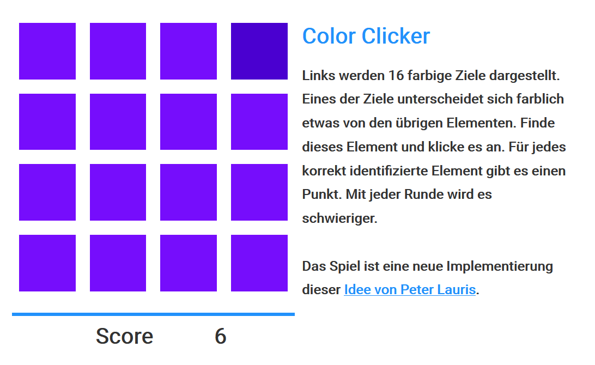

# Simple Color Clicker

In dieser Aufgabe planen und implementieren Sie ein einfaches Javascript-Spiel. Dabei handelt es sich um eine Neuimplementierung des [*Color Picker*](https://gamejolt.com/games/color-picker/35110) von Peter Lauris. In diesem Spiel werden den SpielerInnen mehrere nahezu gleichfarbige Quadrate präsentiert. Der Farbton einer der Flächen unterscheidet sich leicht von den anderen. Die SpielerInnen müssen dieses abweichende Quadrat identifizieren. Gelingt ihnen dies, wird die nächste Runde gestartet die Farbabweichung verringert wird. Wählen die SpielerInnen ein falsches Quadrat aus, wird das Spiel neugestartet. Die Farben werden zufällig gewählt und im RGB-Raum abgebildet. Farbabweichungen werden durch die Veränderung aller drei Kanäle um den gleichen Wert berechnet.

Die Aufgabe dient als einfacher Einstieg in die grundlegenden Methoden und Techniken, die im weiteren Kurs zur Implementierung von Webanwendungen eingesetzt werden. Sie machen sich mit HTML und CSS zur Strukturierung und Gestaltung des *User Interface* vertraut und gewinnen erste Erfahrungen in der Verwendung von *JavaScript* zur programmatischen Manipulation des *UIs*. Im Fokus steht dabei nicht das *Software Design* oder die allgemeine Codequalität. Viele Aspekte werden im Laufe des Semesters und den späteren Demos und Aufgaben anders gelöst. Dazu gehört insbesondere die Strukturierung und Modularisierung des Codes, die in dieser Demo sehr einfach gehandhabt wird.

## Lösung

Eeinen Lösungsvorschlag finden Sie auf [Github](https://github.com/Multimedia-Engineering-Regensburg-Demos/MME-SimpleColorClicker).