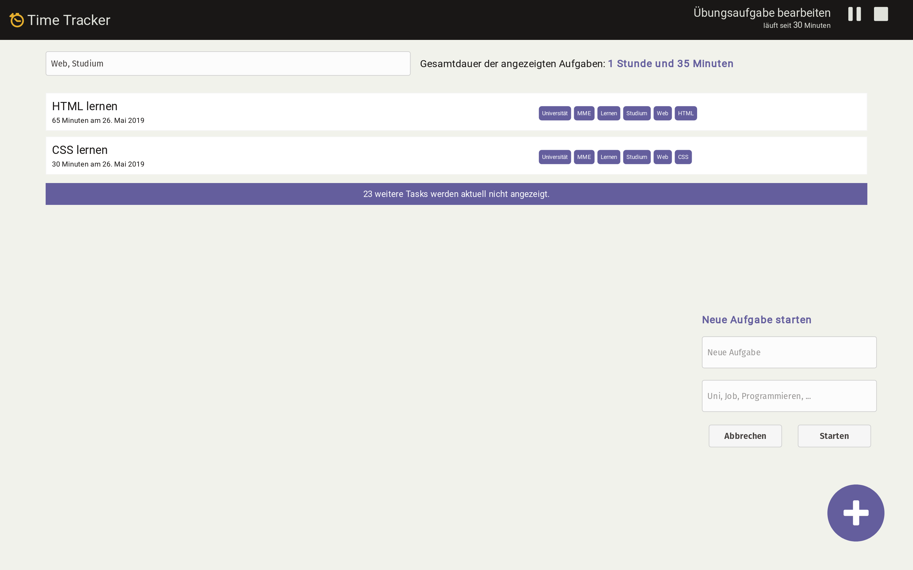

 
# Time Tracker

In dieser Aufgabe planen und implementieren Sie eine Anwendung zur Zeiterfassung. Der Schwerpunkt liegt dabei auf dem gemeinsamen Entwurf eines geeigneten Software Designs sowie der anschließenden kollaborativen Implementierung der Anwendung. Im Rahmen der Aufgabe trainieren Sie das Skizzieren und Diskutieren von Anforderungen und Architekturen, das planvolle Vorgehen bei der Implementierung und vor allem die gemeinsame Arbeit an einer gemeinsamen Problemstellung.

## Aufgabenbeschreibung

Grundlage für die Arbeit an der Anwendung ist ein gemeinsames Github-Repository, in dem die verschiedenen Teammitglieder eigene Teillösungen der Aufgabe beisteuern können. Die Entwicklung selbst geschieht in zwei Phasen. Zu Beginn entwerfen die Teams - ausgehend von den aufgelisteten Anforderungen - ein Design für die Software. Dazu gehört die Identifikation der notwendigen Komponenten, deren Aufgaben und die Kommunikation zwischen den verschiedenen Bestandteilen der Anwendung. Darauf aufbauend implementieren Sie eine lauffähige Variante der Anwendung. Versuchen Sie dabei eine geeignete Reihenfolge und Arbeitsteilung zu finden und organisieren Sie die Arbeit entsprechend innerhalb des Teams.

### Vorbereitung

Das notwendige Repository können Sie über [diesen Link](https://classroom.github.com/g/bj8WewbS) erstellen. Zu Beginn muss einmalig ein Team angelegt werden, überlegen Sie sich dazu einen passenden Namen für Ihre Gruppe. Anschließend können alle Gruppenmitglieder diesem Team über den selben Link beitreten. Clonen Sie anschließend das so erstellte Repository auf allen Rechnern, die Sie zur Bearbeitung der Aufgaben einsetzen wollen.

!!! warning Hinweis
	Achtung! Sie arbeiten jetzt an einer gemeinsamen *code base*. Das erstellte Github-Repository dient als zentrale Sammelstelle für die Beiträge der einzelnen Teammitglieder. Jedes Mitglied arbeitet in einem lokalen Repository, das mit dem zentralen *Remote* verbunden ist. Über die Git-Funktionen übertragen Sie Änderungen aus dem *Remote* in Ihre lokale Arbeitskopie (*pull*) und stellen Ihre eigenen Änderungen zentral bereit (*push*). Versuchen Sie dabei die folgende Reihenfolge beizubehalten: 1) *Committen* Sie Ihre Änderungen, 2) *Pullen* Sie den aktuellen Status aus dem zentralen Repository und beheben Sie etwaige Konflikte und 3) *Pushen* Sie abschließend den neuen Zustand der Anwendung in den *Remote*. Ein kleinteiliges und stark modularisiertes Design, in dem einzelne Komponenten in isolierten Dateien abgebildet werden, verhindert viele Probleme. Insbesondere, wenn Sie die Implementierung im Team entlang dieser Struktur aufteilen und versuchen, an unterschiedlichen, schwach verbundenen Komponenten der Anwendung zu arbeiten. Planen Sie gemeinsam die Schnittstellen und Aufgaben der Komponenten und entwickeln Sie die interne Funktionalität anschließend parallel und in Einzelarbeit.

!!! warning "Hinweis"
	Implementieren Sie zuerst eine rudimentäre Version der Anwendung, die alle wichtigen Teilschritte implementiert, um eine vollständige, aber prototypische, Demonstration der Funktionalität zu erlauben. Beginnen Sie erst im Anschluss damit, die einzelnen Teilbereiche vollständig auszubauen. Das aus einem solchen Vorgehen entstehende Artefakt bezeichnet man im Projektmanagement, vor allem im Kontext der Videospielentwicklung, häufig als [*vertical slice*](https://en.wikipedia.org/wiki/Vertical_slice).

## Anforderungen

Die implementierte Anwendung soll am Ende über die folgenden Funktionen verfügen. Gerne können Sie weitere, sinnvolle *Features* ergänzen. Konzentrieren Sie sich in der ersten Iteration aber auf die hier aufgeführten Anforderungen.

- Die Anwendung erlaubt das Erfassen von Aufgaben. Aufgaben bestehen aus einem beschreibenden Text sowie einer beliebigen Menge an *Labels* (Schlagworte)

- Eine neu erstellte Aufgabe wird automatisch *getrackt*, d.h. die Bearbeitungsdauer wird gemessen und gespeichert. Das Messen der Bearbeitungsdauer kann temporär pausiert und endgültig abgeschlossen werden.

- Die Anwendung stellt alle abgeschlossenen Aufgaben in Form einer Liste dar. Dabei werden Beschreibungstext, Datum und Dauer der Bearbeitung sowie die zugeordneten *Labels* angezeigt.

- Über die Eingabe beliebig vieler *Label* kann die Aufgabenliste anhand dieser Kriterien gefiltert werden. Wird eine gefilterte Liste dargestellt, gibt die Anwendung an, wie viele Aufgaben aktuell nicht dargestellt werden.

## Vorgehen

Sie haben insgesamt drei Stunden für die Bearbeitung der Aufgabe zur Verfügung. Versuchen Sie sich dabei an den folgenden Zeit- und Vorgehensplan zu halten:

Phase | Aufgabe | Zeitaufwand | Erwartete Ziele 
:-----|:--------|:---------------:|:----------------
Vorbereitung | Team und Repository erstellen, lokale Arbeitsumgebung einrichten und testen  | 5min | Alle Teammitglieder haben Zugang zu einem gemeinsamen Github-Repositoy, in dem der Startercode verfügbar ist. Alle Teammitglieder verfügen über eine lokale Kopie des Repository und können Änderungen zentral bereitstellen
Vorbereitung | Starterpaket und Anforderungen durcharbeiten | 5min | Das Team verfügt über einen groben Überblick über die vorhandenen UI-Strukturen sowie die aufgelisteten Anforderungen
Planung | Komponenten planen und strukturieren | 20min | Das Team verfügt über eine schriftlich festgehaltene Skizze des *Software Designs*. Dazu gehört eine Übersicht über die notwendigen Komponenten und deren Aufgaben
Planung | Kommunikation planen | 10min | Das Team verfügt über eine schriftlich festgehaltene Skizze, aus der hervorgeht wo, wann und wie zur Laufzeit Informationen zwischen den Komponenten ausgetauscht werden
Planung | Projektverzeichnis vorbereiten | 5 min | Für alle geplanten Komponenten sind entsprechende (leere) Dateien im Projektverzeichnis erstellt worden. Diese Struktur ist im zentralen Repository verfügbar gemacht worden.
        | 5 Minuten Pause
Implementierung | Implementierung der Aufgabe | 100 min | Wesentliche Funktionen der Anwendung wurden umgesetzt und können über die im zentralen Repository verfügbare *code base* getestet werden
        | 5 Minuten Pause
Retrospektive | Vorstellung der Lösung und Bericht über Probleme | 30 min | Das Team kann die wesentlichen Komponenten der Anwendung beschreiben und vorstellen, die funktionierenden Features demonstrieren und über aufgetretene Probleme berichten

### Hilfsmittel zur Planung und Strukturierung

Nutzen Sie im Rahmen der Planung und Dokumentation alle Hilfsmittel, die Ihnen sinnvoll erscheinen. Skizzieren Sie die grobe Struktur der Anwendung (analog oder digital) und notieren Sie wichtige Informationen zur Funktion der einzelnen Komponenten direkt im Code des jeweiligen Moduls. Halten Sie dabei vor allem fest, wie die Schnittstellen zwischen den Komponenten gestaltet werden sollen. Legen Sie die verschiedenen Moduldateien, inhaltlich sortiert, in unterschiedlichen Unterordnern des Quellcodeverzeichnis (`js`) ab. Pro Ordner können Sie dort in einer `Readme.md`-Datei Informationen zu den Aufgaben der jeweiligen Komponenten festhalten[^1]. 

## Vorgaben im Starterpaket

Das Starterpaket gibt nur die HTML-Struktur bzw. die Benutzeroberfläche vor. Nicht benötigte Elemente können über die CSS-Klasse `.hidden` ausgeblendet werden. Das UI ist grob in drei Bereiche aufgeteilt:

### Informationen zum aktuellen Task

Im HTML-Element mit der ID `current-task` werden Informationen zum aktuellen, aktiven Task angezeigt. Diese umfassen die textuelle Beschreibung der Aufgabe sowie die laufend aktualisierte Bearbeitungsdauer. Über die Schaltflächen (Kindelemente unter `.task-controls`) wird die aktive Aufgabe pausiert oder beendet. 

### Filterbare Übersicht über alle Tasks

Im Element mit der ID `tasks` wird eine filterbare Liste aller abgeschlossener Tasks angezeigt. Filterkriterien werden im Suchfeld (`#search-input`) eingegeben. Die Gesamtdauer der aktuell sichtbaren Tasks werden im Element mit der ID `search-results` angezeigt. Ist das Suchfeld leer, werden alle gespeicherten Tasks eingeblendet.

Einzelne Tasks werden in einer Liste (`<ul>`) des `tasks`-Element angezeigt. Verwenden Sie zur Darstellung der Listeneinträge die Templates aus den Elementen mit den IDs `task-entry` und `task-label`. Wird eine gefilterte Liste dargestellt, wird am Ende der Liste das Element mit der Klasse `filter-info` eingeblendet, indem die Anzahl der aktuell ausgeblendeten Elemente dargestellt wird.

### Hinzufügen eines neuen Tasks

Neue Tasks werden über ein Formular (Element mit der ID `new-task`) erstellt, das über einen Klick auf den Button (ID `task-button`) ein- bzw. ausgeblendet wird. Ein neu hinzugefügter Task wird automatisch zur aktiven Aufgabe und ersetzt ggf. einen aktuell laufenden Task.

### Javascript und Modulstruktur

Verwenden Sie das existierende Javascript-Modul in der Datei `index.js` als Einstiegspunkt in den Anwendungsablauf. Erstellen Sie alle weiteren Module in sinnvoll benannten Unterordnern des `js`-Verzeichnis.

## Starterpaket und Lösung

Ein vorbereitetes Starterpaket zur selbständigen Implementierung der Aufgabe sowie einen Lösungsvorschlag finden Sie auf [Github](https://github.com/Multimedia-Engineering-Regensburg-Demos/MME-Time-Tracker). Die Lösung findet sich im `master`-Branch des verlinkten Repositories. Das Starterpaket im `starter`-Branch.

[^1]: In der Webansicht von *Github* werden beim *Browsing* durch die Repository-Ordner Dateien dem Namen `Readme.md` automatisch gerendert und können so z.B. gut als Inhaltsverzeichnisse oder Beschreibungstext verwendet werden. Dieses Feature funktioniert im Wurzelverzeichnis und allen Unterordnern. Sie können dabei die Markupsprache [Markdown](https://help.github.com/en/articles/basic-writing-and-formatting-syntax) verwenden, um Ihre Dokumente zu strukturieren und zu gestalten.