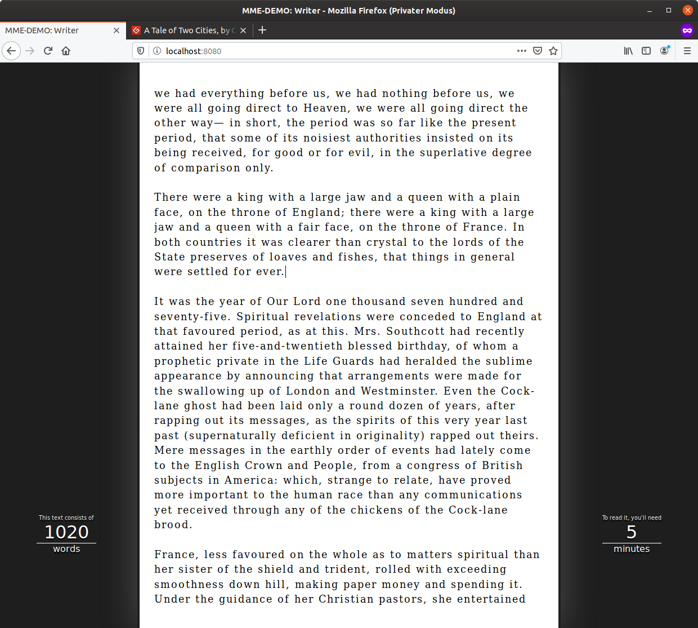

 
# Writer

In dieser Demo implementierten Sie einen einfachen, *Browser*-gestützten Text-Editor. NutzerInnen können diesen verwenden um Texte zu verfassen, die automatisch, lokal und dauerhaft im *Browser* gespeichert werden. Während der Texteingabe werden dem Nutzer Statistiken zum aktuellen Text (Wortanzahl und Lesegeschwindigkeit) angezeigt. Die Architektur der Anwendung basiert auf unterschiedlichen Komponenten, die auf Basis von [ES6-Modulen](../../MME/closures-and-module-pattern) strukturiert werden und deren Zuständigkeitsbereiche sich grob entlang des *MVC*-Ansatzes einordnen lassen. 

Die Demo dient der praktischen Umsetzung und Einübung der vorgestellten Konzepte zur [Modularisierung von Anwendungen](../../MME/closures-and-module-pattern). Zusätzlich können Sie hier die Grundlagen des bekannten [*model-view-controller*](https://en.wikipedia.org/wiki/Model%E2%80%93view%E2%80%93controller)-Ansatzes auffrischen. 

## Aufbau der Anwendung

Die Anwendung besteht aus vier Modulen. Als zentrale Komponente dient dabei das in der Datei `app.js` implementierter Module, in dem die anderen Komponenten initialisiert und miteinander verknüpft werden. 

Das **Textfeld** wird in einem *Controller*-Modul (`Editor`) verwaltet. Grundlage für die Texteingabe und -darstellung ist ein `<textarea>`-Element. Nutzereingaben in diesem Feld können über das `keyup`-Ereignis abgefangen werden. 

Die dynamischen Bereiche der Benutzeroberfläche werden in einem *View*-Modul (`StatsView`) verwaltet. In der HTML-Struktur werden dazu zwei Elemente zur **Anzeige** der Textstatistiken vorgegeben (`.stats .words` und `.stats .time`). Über deren `innerHTML`-Eigenschaft können die jeweils aktuellen Statistiken gesetzt werden. 

Versuchen Sie die Module grundsätzlich so aufzubauen, dass die **notwendigerweise öffentlich zugänglichen Bereiche in Form eines Prototypen exportiert** werden während alle übrigen Bestandteil nur Modul-intern verwendet werden können. 

Die dauerhafte **Speicherung** des eingegebenen Texts erfolgt in einem weiteren Modul (`Storage`). Die Kommunikation zwischen den Modulen wird entweder über öffentliche Methoden oder, im Falle der *Controller*-Schicht, über die Implementierung des *Observer Pattern* realisiert. Dazu wird in der Datei `utils/Observable.js` der Prototyp eines *Observers* bereit gestellt.

## Ausgangslage

Sowohl das HTML-Dokument (`index.html`) als auch die CSS-Regeln (`style.css`) sind vollständig vorgegeben. Beim Laden des Dokuments wird automatisch die `init`-Methode des zentralen Moduls aus der Datei `app.js` ausgeführt. Hier wird bereits auf den, in Grundzügen vorhanden und aus dem Modul bzw. der Datei `ui/Editor.js` importierte, Prototyp `Editor` zugegriffen. Anhand des vorhandenen *Codes* können Sie die grundsätzliche Funktionalität der notwendigen *Observer* -Schnittstelle testen.

!!! hint "Starten der Anwendung"
	Denken Sie daran, die Anwendung über den integrierten Webserver zu starten (`npm start` im Projektverzeichnis aufrufen). Vorher müssen Sie den Server über den Befehl `npm install` lokal installieren. Sobald der Server gestartet worden ist, können Sie über die URL `http://localhost:8080` auf die Anwendung zugreifen. Ggf. müssen Sie die URL noch um den konkreten Verweis auf das HTML-Dokument erweitern: `http://localhost:8080/index.html`.

## Aufgabenstellung

Implementieren Sie nacheinander die verschiedenen Komponenten (Module und Prototypen), die für die unterschiedlichen Funktionsbereiche der Anwendung zuständig sind. Das in Grundzügen bereits vorhandene Modul in der Datei `app.js` dient als zentrale Komponente der Anwendung. Es ist für die Initialisierung und Steuerung der übrigen Module verantwortlich. 

### Vorgehen

1. Implementieren Sie in einem Modul eine Komponente, die Eingaben im [Textfeld](https://developer.mozilla.org/en-US/docs/Web/API/HTMLTextAreaElement) erkennt und daraus berechnete Statistiken über eine *Observer*-Schnittstelle nach Außen gibt als separaten Prototypen (*class*) und nutzen Sie zur Ergänzung der *Observable*-Funktion den bereitgestellten Prototypen und das [`extends`-Schlüsselwort](https://developer.mozilla.org/en-US/docs/Web/JavaScript/Reference/Classes/extends). Während der Texteingabe informiert der Prototyp registrierte *Listener* über die aktuelle Anzahl der Wörtern sowie die geschätzte Lesedauer[^1]. Der relevante Bereich der Benutzerschnittstelle (HTML-Elemente) wird dem Prototypen bei der Initialisierung als Parameter übergeben. Überlegen Sie sich, welche Funktionalität im Prototypen selbst und welche im umschließenden Modul implementiert werden kann.

2. Implementieren Sie in einem weiteren Modul eine Komponenten, die für die Aktualisierung der beiden Anzeige-Elemente (*Wortanzahl* und *Lesedauer*) zuständig ist. Bei Initialisierung wird dem Modul bzw. dessen bereitgestellter Schnittstelle (Prototyp) der relevante Bereich des UIs (hier: `#stats`) übergeben. Die Komponente bietet eine *öffentliche* Methode an, über die die Aktualisierung der beiden Anzeige-Elemente möglich ist. Dieser Methode wird als Parameter ein Objekt übergeben, in dem die aktuelle Wortanzahl und die geschätzte Lesedauer als Eigenschaften gespeichert sind.

3. Verwenden Sie die beiden implementierten Komponenten im zentralen Modul (`app,js`). Speichern Sie dazu die initialisierten Prototypen (die Schnittstellen zu den Modulen) in lokalen Variablen und verknüpfen Sie die erzeugten *Events* des `Editors` mit den öffentlichen Methoden des `StatsView`.

4. Implementieren Sie selbstständig die persistente Speicherung des eingegebenen Texts in einem zusätzlichen `Storage`-Modul (Datei: `Storage.js`). Verwenden Sie dazu das `localStorage`-Objekt aus der [Storage-API](https://developer.mozilla.org/en-US/docs/Web/API/Storage). Integrieren Sie an geeigneter Stelle das Speichern und Wiederherstellen des Textes in den Anwendungsablauf.

## Starterpaket und Lösung

Ein vorbereitetes Starterpaket zur selbständigen Implementierung der Aufgabe sowie einen Lösungsvorschlag finden Sie auf [Github](https://github.com/Multimedia-Engineering-Regensburg-Demos/MME-Writer). Die Lösung findet sich im `master`-Branch des verlinkten Repositories. Das Starterpaket im `solution`-Branch.

[^1]: Um die [Lesegeschwindigkeit](https://de.wikipedia.org/wiki/Lesegeschwindigkeit) zu berechnen, können Sie davon aus gehen, dass ein normaler Leser ca. 200 Wörter pro Minute lesen kann.