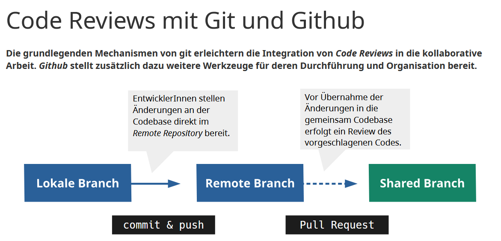

# Softwarequalität mit Code Reviews sichern

Ein wesentlicher Teil des Softwareentwicklungsprozesses sind Maßnahmen zur Qualitätssicherung. Der Begriff *Qualität* bezieht sich dabei auf sehr unterschiedliche Aspekte der entwickelten Software: Neben der funktionalen Güte können auch Vorgänge oder Prozesse oder Teil-Artefakte untersucht und bewertet werden. Der Kontrolle und Verbesserung des Quellcodes wird dabei besonders viel Aufmerksamkeit gewidmet, da dieser, neben der vom Nutzer verwendbaren Anwendung, den zentralen und wichtigsten Bestandteil des Entwicklungsprojekt bildet. Qualitätskriterien, hinsichtlich denen Quellcode untersucht werden kann, beziehen sich unter anderem auf dessen Fehlertoleranz, funktionalen Vollständigkeit, Lesbarkeit oder Wartbarkeit. Zur Sicherung dieser gewünschten Eigenschaften haben sich im *Software Engineering* verschiedene Methoden als nützlich erwiesen:

- Mittels **Testing** und **Debugging** werden logische bzw. funktionale Schwachstellen im *Code* gesucht und behoben.
- In der statischen **Code-Analyse**, etwa beim *Linting*, werden automatische Verfahren zur Untersuchung einzelner Teilbereiche des Quellcodes eingesetzt um z.B. formale oder qualitative Probleme aufzuzeichnen.
- Die manuelle, intellektuelle Prüfung des Quellcodes wird in der Regel als **Review** bezeichnet.

## Code Reviews

Durch *Code Review* soll die Qualität des Quellcodes, insbesondere seiner Lesbarkeit, Konsistenz und Verständlichkeit gesteigert werden. Durch das manuelle Prüfen einzelner Abschnitt des Programmcodes können Probleme (z.B. Sicherheitslecks) oder Verbesserungsmöglichkeiten (z.B. Performance-Optimierungen) aufgezeigt werden. *Reviews* können von unterschiedlichen Personengruppen, etwa Angehörigen des Entwicklungsteams oder externen Experten durchgeführt werden. Innerhalb eines Unternehmens dienen regelmäßige *Reviews* durch Kolleginnen und Kollegen auch dem Wissenstransfer innerhalb des Teams. Durch die gemeinsame und geteilte Verantwortung für die qualitative Güte des Programmcodes, können *Reviews* in diesem Kontext auch zu einer gesteigerten [*Collective Code Ownership*](https://martinfowler.com/bliki/CodeOwnership.html) beitragen. Gerade in größeren Projekten sind *Reviews* auch eine gute Möglichkeit, um die Einhaltung von Prozessrichtlinien zu prüfen bzw. sind die *Reviews* selbst ein elementare Bestandteile dieser Prozessrichtlinien.

## Formale und informelle Reviews

Schon relativ früh in der Geschichte der Softwaretechnik wurden formale Abläufe für *Reviews* erstellt. Michael Fagan[^1] stellte bereits 1976 einen mehrstufigen Prozess für solche *Reviews* vor, der, ausgehend von einer umfangreichen Planung und Vorbereitung eine gemeinsame Sitzung vorsieht, in der Autoren und (externe) Experten, Teilbereiche des Quellcodes (oder anderer Artefakte) systematisch prüfen und Erkenntnisse und Einschätzungen über die betrachteten Komponenten dokumentieren und für den weiteren Entwicklungsprozess aufbereiten. Fagan stellt fest, dass durch diese formalisierten Prozesse nicht nur ein großer Teil der Softwarefehler (bis zu 90%) identifiziert werden konnte, sondern das die Ergebnisse und die *Review* selbst einen positiven Effekt auf den weiteren Entwicklungsprozess haben.

In vielen Bereichen der Softwareentwicklung wird eine weniger stark formalisierte Variante der *Code Reviews* angewendet, die stark in den praktischen Arbeitsalltag integriert ist. Dabei werden die *Reviews* als ein ständiger und integraler Schritt des kollaborativen Entwicklungsprozess angesehen. Dieser muss nicht individuell geplant und terminiert werden, sondern steht am Ende jedes kurzen, Feature-orientierten Entwicklungszyklus. Jedes Feature bzw. jeder Beitrag eines Entwicklers bzw. einer Entwicklerin wird vor der Übernahme in die gemeinsame [*Codebase*](https://en.wikipedia.org/wiki/Codebase) durch andere MitgliederInnen des Teams geprüft und bewertet. Identifizierte Probleme und Schwächen müssen vor der endgültigen Integration des Codes ausgebessert werden. Moderne Entwicklungsprozesse auf Basis entsprechender Versionskontroll- und Projektmanagementsysteme erlauben eine eine organisatorische und technische Integration dieser Abläufe in den Entwicklungsprozess. Bei der Verwendung von `git` oder *github* geschieht dies in der Regel über die *Pull Requests*. Beiträge einzelner AutorInnen werden in separaten *Branches* erstellt. Sobald diese in eine gemeinsam genutzte *Branch* überführt werden sollen, [erstellen die ursprünglichen EntwicklerInnen einen Request](https://help.github.com/en/github/collaborating-with-issues-and-pull-requests/about-pull-requests) und bitten das restliche Team damit über die Übernahme der Änderungen in die gemeinsame *Codebase*. Vor dem *Merge* der *Branches* besteht nun die Möglichkeit, die Änderungen zu sichten und zu diesen Stellung zu nehmen. Der designierte *Reviewer* entscheidet, ob die neuen Bestandteile dem restlichen Team bereitgestellt werden können, oder ob vorher qualitative oder funktionale Änderungen notwendig sind. Github stellt zu diesem Vorgang auch eine [übersichtliche und verständliche Anleitung bzw. Beschreibung](https://github.com/features/code-review/) bereit.

Code Reviews mit Git und Github

### Hilfsmittel für Code Reviews

Bei der Organisation und Durchführung von *Code Review* werden EntwicklerInnen durch zahlreiche Werkzeuge unterstützt:

- Plattformen wie Github oder [GitLab](https://about.gitlab.com/) bieten technische Lösungen für *Code Reviews* an: *Pull Requests* können über die Weboberfläche erstellt und bearbeitet werden. Die relevanten Stellen des geänderten Quellcodes können z.B. auf Github direkt angesehen, kommentiert und diskutiert werden.
- Guidelines und Checklisten helfen den AutorInnen eines Reviews bei der Inspektion des Codes und der Formulierung von Feedback. Eine sehr umfangreiche Sammlung zu *Code Reviews* im eigenen Unternehmen stellt z.B. [Google öffentlich zur Verfügung](https://google.github.io/eng-practices/review/reviewer). Die Hinweise und Anmerkungen sind in der Regel auf 
einem so abstrakten Level, dass diese gut auf eigene Projekte übertragen werden können. Zu beachten ist aber, dass Google eine sehr spezielle Form der 
Versionsverwaltung ([Piper](https://cacm.acm.org/magazines/2016/7/204032-why-google-stores-billions-of-lines-of-code-in-a-single-repository/fulltext)) verwendet, wodurch sich bestimmte Details des Prozesses von z.B. dem *Pull Request*-Ansatz über Github unterscheiden können.

## Code Reviews in diesem Kurs

In diesem Kurs fertigen Sie Reviews für Ihre Kommilitonen an und erhalten im Gegenzug Feedback zu Ihrem eigenen Code. Die Reviews sollen Ihnen dabei bei der Verbesserung Ihrer eigenen Programmierkenntnisse helfen, vor allem aber auch Ihre Kompetenzen im Bezug auf die Bewertung und Beschreibung fremden Codes schärfen. Gute *Reviews* zu schreiben ist eine Fähigkeit, die in der Regle nur durch Erfahrung und häufiges Ausprobieren gemeistert werden kann. Studien zeigen[^2], dass das Anfertigen von *Reviews* durch bzw. für Studierende zahlreiche positive Effekte auf die Lernenden haben kann.

### Ablauf

Nach jeder der Übungsaufgaben wird Ihnen die Lösung eines Ihrer Kommilitonen aus Ihrer Übungsgruppen zugewiesen. Sie erhalten dazu automatisch Zugriff auf das entsprechende Repository auf Github. Dort erstellen wir einen *Pull Request* mit allen Informationen, die Sie zur Bewertung des Codes bzw. zur Anfertigung Ihres Feedbacks benötigen. Sie können die Beiträge Ihrer Kommilitonin bzw. Ihres Kommilitonen direkt auf Github einsehen und dort auch im Code kommentieren. Zusätzlich haben Sie die Möglichkeit allgemeine Kommentare und Bemerkungen zum Code zu formulieren. Dazu stellen wir Ihnen eine kurze Checkliste bereit, anhand derer Sie den Quellcode untersuchen können. 

#### Checklisten-Beispiele für Reviews in diesem Kurs 

- Entsprechen Formatierung und Gestaltung den ausgemachten Guidelines (ESLint) und bekannten Gestaltungsregeln?
- Ist der Code verständlich formuliert? Wurden treffende Bezeichner verwendet?
- Können *Code Smells* identifiziert werden? Ist der Code modular und wartbar aufgebaut?
- Befinden sich nicht benötigte Fragmente im Code?
- Werden nicht benötigte Debug- oder Log-Ausgaben erzeugt?
- Werden wichtige Bestandteile und Komponenten des Codes 
kommentiert?
- Werden offensichtliche Grenz- und mögliche Fehlerfälle beschrieben? Werden diese Grenz- und Fehlerfälle abgefangen und geprüft?
- Werden Ein- und Ausgabewerte auf Korrektheit und Kompatibilität 
geprüft?

[^1]: Michael Fagan, Design and Code Inspections to Reduce Errors in Programm Development, IBM Systems Journal, Band 15, Ausgabe 3, 1976
[^2]: Xiaosong Li, Christine Prasad, Effectively teaching coding standards in programming, in: 
Proceedings of the 6th conference on Information technology education. ACM, Newark, 2005