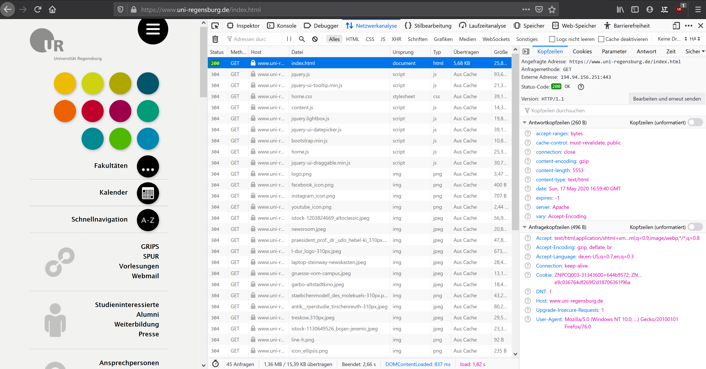

# HTTP und das REST-Prinzip

Als Internet bezeichnet man das weltweite Netzwerk aus Computern, die über das [Internet Protocol](https://en.wikipedia.org/wiki/Internet_Protocol) Informationen austauschen. Das heutig Internet entwickelte sich, ausgehend vom [Advaced Research Projekts Agency Network](https://en.wikipedia.org/wiki/ARPANET) in den 1970er Jahren, zum wahrscheinlich wichtigsten Informations- und Kommunikationsmedium der heutigen Zeit. Auf dieser technischen Grundlage haben sich zahlreiche Dienste etabliert, die die Netzwerkstruktur des Internets und die IP-Kommunikations für unterschiedliche Zwecke nutzten. Dazu gehören z.B. E-Mail-Dienste, *Filesharing*-Lösungen oder das [World Wide Web](https://en.wikipedia.org/wiki/World_Wide_Web).

## Das WWW und HTTP

Als *World Wide Web* wird der HyperText-Informationsraum bezeichnet, der aus über das Internet verteilt bzw. zugänglich gemachten, vernetzten Webseiten besteht. Als historischer Startpunkt für dieses Informationsnetz gilt das Ende der 1980er-Jahre. Zu dieser Zeit entwarf und implementierte [Tim Berners-Lee](https://en.wikipedia.org/wiki/Tim_Berners-Lee) am CERN die wesentlichen Bausteine des WWW: Die Markupsprache **HTML**, das Konzept der eindeutigen Dokumentenidentifikation (später **URL** genannt), den ersten **Web-Server** und den ersten **Web-Browser**. Zur technischen Umsetzung der Kommunikation zwischen *Client* (Browser) und *Server* schuft Berners-Lee das *Hypertext Transfer Protocol*, kurz HTTP [1].

## Das Hypertext Transfer Protocol

HTTP ist ein Netzwerkprotokoll, das zur Übertragung von Daten zwischen Anwendungen im WWW dient. Es handelt sich um ein *Plain Text*-Protokoll, mit dem Anfragen (*Request*) eines *Clients* an einen Server sowie dessen Antworten (*Response*) formuliert werden können. Als Übertragungskanal wird im WWW das Internet bzw. das *Internet Protocol* verwendet. HTTP formalisiert den Aufbau der Nachrichten, die zwischen *Client* und *Server* ausgetauscht werden. Die Erstellung und Interpretation der übertragenen Inhalte wird von den jeweiligen Anwendungen, als z.B. einem Web-Browser oder einem Web-Server übernommen.

### Merkmale von HTTP

HTTP-Nachrichten bestehen aus einem `HEADER` und einem `BODY`. Der *Head*-Bereich beschreibt die Nachricht bzw. die Kommunikation zwischen *Client* und *Server*, der *Body*-Bereich beinhaltet die eigentlichen Daten. Im Kontext des WWW wird über den *Body*-Bereich einer Serverantwort z.B. häufig der HTML-Code einer Webseite übergeben, die ein *Client*, z.B. ein Browser angefragt hat.

**Eine einfache Anfrage an den Webserver der Uni Regensburg könnte z.B. so aussehen:**

``` 
GET /sprache-literatur-kultur/medieninformatik/ HTTP/1.1
Host: www.uni-regensburg.de
```

Im *Head*-Bereich der Nachricht werden Ziel (`Host`) der Anfrage und das gewünschte Dokument (`GET`) sowie die verwendete Protokollversion angegeben. Der *Body*-Bereich ist in diesem einfachen Fall leer.

**Eine mögliche Antwort auf diese Anfrage könnten in etwas so formuliert werden:**

```
HTTP/1.1 200 OK
Cache-Control: must-revalidate, public
Content-Encoding: gzip
Content-Length: 10288
Content-Type: text/html
Date: Tue, 14 Jul 2015 14:41:30 
Server: Apache

<html>
<h1 id="content-start">Aktuelle Meldungen 
```

Im *Body*-Bereich (hier durch eine Leerzeile abgetrennt) findet sich der Inhalt des angeforderten HTML-Dokuments. Im *Head*-Bereich übermittelt der Server verschiedene Meta-Daten, die den Client bei der Interpretation der Anwort unterstützen:

- In der ersten Zeile wird u.a. ein [Statuscode](https://developer.mozilla.org/en-US/docs/Web/HTTP/Status) übermittelt, der über den Erfolg oder etwaige Probleme bei der Beantwortung der Anfrage Auskunft gibt. In diesem Fall signalisiert der Code `200`, das der Server die Anfrage erfolgreich beantworten konnte. Mit anderen Codes können spezifische Fehlersituationen z.B. nicht gefundene Dokumente (`404`), fehlende Zugriffsrechte (`403`) oder serverseitige Probleme bei der Verarbeitung der Anfrage (`500`) beschrieben werden.
- In der Server-Antwort können weitere Hinweise enthalten sein: z.B. ob ein Client-seitiges *Cachen* der übermittelten Inhalte sinnvoll ist (*Cache-Control*) oder in welchem Format die Anwort formuliert ist (*Content-Type*). 

HTTP kann nicht nur für den einseitigen Austausch von Informationen zwischen Server und Client verwendet werden. Obwohl einzelne Kommunikationen immer aus einem *Request* des Clients und einer entsprechenden *Response* des Servers bestehen, können auf dieser Basis auch bidirektionaler Informationsaustausch erfolgen und damit komplexe Anwendungsszenarien umgesetzt werden. Zu diesem Zweck sind in HTTP mehrere *Request Methods* enthalten, die eine Unterscheidung der Intention einzelner Anfragen erlauben[2]. Diese Methoden, häufig auch *HTTP Verbs* genannt, werden in den `HEADER` des *Request* eingetragen und erlauben dem Server eine entsprechende Interpretation der Anfrage. Die wichtigsten *Verbs* sind:

| Verb | Zweck (Zitat aus [Mozilla Developer Network](https://developer.mozilla.org/en-US/docs/Web/HTTP/Methods) |
|------|-------|
| `GET` | *The GET method requests a representation of the specified resource. Requests using GET should only retrieve data.* |
| `POST` | *The POST method is used to submit an entity to the specified resource, often causing a change in state or side effects on the server.* | 
| `PUT` | *The PUT method replaces all current representations of the target resource with the request payload.* | 
| `DELETE` | *The DELETE method deletes the specified resource.* | 

### HTTP-Kommunikation im Browser nachvollziehen

Mit Hilfe der *Developer Tools* Ihres Browsers können Sie die HTTP-Kommunikation zwischen Browser und Client leicht nachvollziehen. Im Firefox heißt der entsprechende Tab *Netzwerkanalyse*. Laden Sie eine Website neu, während die Entwicklerkonsole geöffnet ist, können Sie in dem Tab jede Anfrage Ihres Browsers sowie die jeweilige Antwort des Servers einsehen und prüfen. Dabei zeigt sich dann auch, das das Laden einer Webseite in der Regel über mehrere Anfragen erfolgt. Ausgehen von initialen HTML-Dokument werden zahlreiche weitere Dateien, z.B. CSS- oder JavaScript-Dateien, Bilder oder Videos angefordert und übertragen. Der Austausch all dieser Inhalte erfolgt über HTTP.



## Representational State Transfer: REST

REST ist ein Paradigma für die Architekturgestaltung verteilter Systeme, z.B. von Client-Server-Anwendungen. Das Konzept wurde von Roy Fielding entworfen[3]. Im REST-Entwurf werden eine Reihe von Eigenschaften (*Properties*) und Einschränkungen (*Constraints*) für verteilte Systeme im allgemeinen bzw. den Datenaustausch innerhalb dieser Anwendungen im speziellen erstellt. Zahlreiche *Web Services* oder Anwendungen im WWW basieren auf diesem Prinzip. Systeme, die den REST-Standard vollumfänglich implementieren werden *RESTful*-Services genannt. Auch Anwendungen oder Schnittstellen (APIs), die die Vorgaben und Philosophien des REST-Standards nur teilweise umsetzten bzw. befolgen werden häufig als REST-Systeme bezeichnet. Die technische Umsetzung der Kommunikationsschicht innerhalb von REST-Anwendungen erfolgt häufig, aber nicht zwangsweise, über HTTP.

### Application State

REST dient der Kommunikation und Manipulation von Systemdaten bzw. dem Anwendungszustand durch Repräsentationsobjekte. Datenobjekte werden durch eindeutige Identifer (z.B. URLs) beschrieben und durch Repräsentationen im System vertreten. Alle Aktionen, die auf den so beschriebenen Daten möglich, werden durch verschieden Aktionen im Kontext der Repräsentation durchgeführt und führen zu einem neuen [State](https://en.wikipedia.org/wiki/State_(computer_science)#Program_state) der Anwendung.

### Zentrale Begriffe im REST-Ansatz

| Data Element | Beschreibung | Beispiel |
|--------------|--------------|----------|
| resource | Abstraktes Ziel eine Anfrage bzw. die angefragte Information selbst. | Ein Artikel innerhalb eines *Content Management System* | 
| resource identifier | Eindeutiger Verweis auf die angefragte Ressource, z.B. die URL auf ein bestimmtes Dokument. | URL zu dem Artikel: `/article/what-is-rest`|
| representation | Die formatierte und übetragene Repräsentation der eigentichen Ressource.| HTML-Darstellung des Artikels, der in der Datenbank eigentlich in anderem Format vorliegt, z.B. als *Plain Text*. |
| representation metadata | Zusätzliche Informationen zur aktuellen Repräsentation der Ressource. | Hinweise auf das Datenformat der Repräsentation, hier z.B. *HTML* |
| resource metadata | Zusätzliche Informationen zur eigentlichen Ressource | Erstellungsdatum der Ressource, bzw. des Artikels |

### Eigenschaften und Constraints von REST-Systemen

Fielding definiert sechs zentrale Eigenschaften, die ein REST-System bzw. die Kommunikation zwischen den Client- und Server-Komponenten innerhalb eines solchen Systems ausmachen:

- **Client-Server Seperation**
- **Stateless**
- **Cache**
- **Layers**
- **Code-On-Demand**
- **Uniform Interface**

Als zusätzliche Eigenschaft eines REST-Systems ergänzt Fielding später noch das HATEOAS-Prinzip: [Hypermedia as the Engine of Application State](https://en.wikipedia.org/wiki/HATEOAS). Hinter diesem Begriff verbirgt sich die Idee, dass ein REST-System grundsätzlich ohne Wissen über dessen internen Aufbau nutzbar sein muss. Ausgehend von einem initialen Einstiegspunkt ergeben sich alle weiteren Anfragemöglichkeiten des Clients durch die Antworten des Servers. Diese beinhalten Referenzen zu weiteren Anfrage-Zielen. Die Kommunikation zwischen Client und Server erfolgt dann in einem Hypermedia- bzw. Hypertext-Raum:

*A REST API should be entered with no prior knowledge beyond the initial URI (bookmark) and set of standardized media types that are appropriate for the intended audience (i.e., expected to be understood by any client that might use the API). From that point on, all application state transitions must be driven by client selection of server-provided choices that are present in the received representations or implied by the user’s manipulation of those representations. The transitions may be determined (or limited by) the client’s knowledge of media types and resource communication mechanisms, both of which may be improved on-the-fly (e.g., code-on-demand). [Failure here implies that out-of-band information is driving interaction instead of hypertext.]*

(Quelle: [Roy Fielding, REST-APIs must be hypertext-driven](https://roy.gbiv.com/untangled/2008/rest-apis-must-be-hypertext-driven))

Nur wenige Systeme im WWW implementieren diese Anforderungen vollumfänglich. Ein Beispiel für eine in großen Teilen frei explorierbare REST-API ist [die Schnittstelle der Github-Plattform](https://api.github.com).

[^1]: Mehr Hintergründe zu HTTP im Mozilla Developer Network: [An overview of HTTP](https://developer.mozilla.org/en-US/docs/Web/HTTP/Overview)
[^2]: Vgl. auch Mozilla Developer Network: [HTTP request methods](https://developer.mozilla.org/en-US/docs/Web/HTTP/Methods)
[^3]: Roy Fielding, [Architectural Styles and the Design of Network-based Software Architectures](https://www.ics.uci.edu/~fielding/pubs/dissertation/fielding_dissertation.pdf)