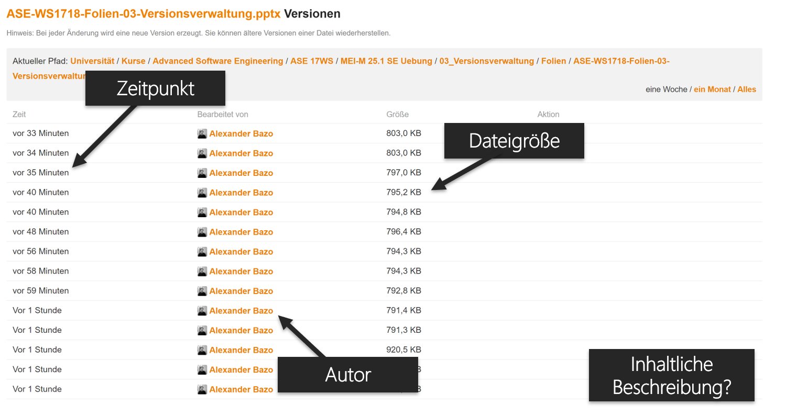
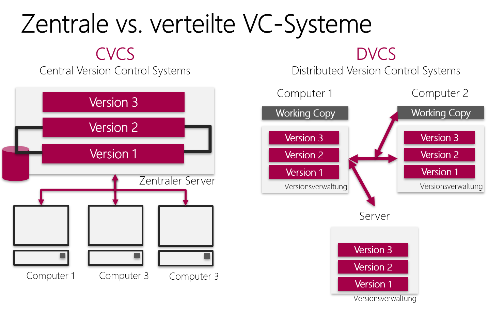
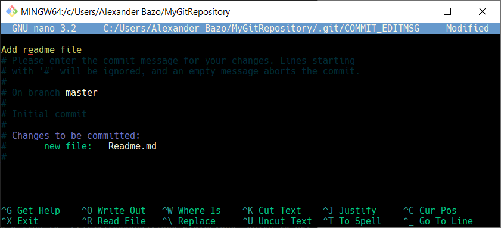
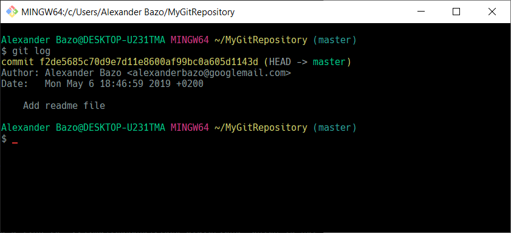

# Versionskontrolle und -verwaltung in der Softwareentwicklung: Grundlagen

Eines der wichtigsten Werkzeuge, die Sie im Rahmen der Entwicklung von Software einsetzen werden, ist die Versionskontrolle. Ein Versionskontrollsystem, bestehend aus Prozessen, Methoden und Anwendungen, beschreibt und dokumentiert die Änderungen an einer Datei oder einer Sammlung von Dateien. Dadurch wird es möglich, den Entstehungsprozess eines Dokuments nachträglich nachzuvollziehen und gezielt verschiedene zeitliche Repräsentationen (Versionen) zu betrachten[^1]. Während heutzutage (und vor allem im Bereich der Softwareentwicklung) nahezu ausschließlich digitale Systeme zum Einsatz kommen, existieren ähnliche Modelle auch in der analogen Welt, z.B. in Form von überarbeiteten und mit entsprechenden Versionshinweisen versehene Neu-Auflagen gedruckter Bücher[^2]. In diesem Kurs werden Sie Versionskontrolle hauptsächlich im Zusammenhang der von Ihnen implementierten Übungsaufgaben und Abschlussprojekte einsetzen. 

## Der Werkzeugbegriff in der Softwaretechnik

Der häufig verwendete Begriff *Tools* (Werkzeug) beschreibt in der Regel konkrete Anwendungen, also Software, die als Mittel zum Erreichen bestimmter Ziele des Nutzers eingesetzt werden. Im Kontext der Entwicklung von Software gehören dazu z.B. Entwicklungsumgebungen, Kompiler oder Anwendungen für das Projektmanagement. Weiter gefasst gehören auch Prozesse und Techniken (z.B. bestimmte Vorgehensmodelle) oder Medien (z.B. Programmier- und Markupsprachen) zu Werkzeugkategorie[^3]. Auch im Bereich der Versionsverwaltung müssen neben den eingesetzten Anwendungen (z.B. *git*) zusätzlich die Modelle und Verfahren betrachtet werden, die auf Basis bzw. durch den Einsatz dieser Anwendungen umgesetzt werden. In der Regel sollte ein im Vorfeld definierter, wohlüberlegter Prozess durch den Einsatz ausgewählter Anwendungen begleitet werden. Vermeiden Sie es, Ihre Arbeitsweise an ein bestimmtes Werkzeug (hier: Anwendung) anzupassen. Wählen Sie stattdessen ein passendes Vorgehen für die zugrundeliegende Problemstellung aus und entscheiden Sie dann, mit welcher Anwendung Sie dieses optimal umsetzen können. Dies ist insofern relevant, als dass Sie die genuinen Ziele und Vorüberlegungen kennen sollten, die im Bereich der Softwareentwicklung mit Versionskontrolle verfolgt werden und z.B. git als Medium zum Umsetzen dieser Ziele, nicht als Maßstab für Versionskontrolle an sich, einsetzen sollen.

## Versionierung vs. Versionskontrolle

Im täglichen Umgang mit digitalen Systemen begegnen uns viele Anwendungen, die auf den ersten Blick eine große Ähnlichkeit mit Versionskontrollsystemen haben. Viele *Cloud*-Speicher, wie z.B. *Dropbox* oder *Seafile*, speichern unterschiedliche Versionen von Dateien. Dabei werden neben dem Änderungszeitpunkt auch Informationen zum Autor der jeweiligen Dateiversion abgespeichert. Der wesentliche Unterschied zu einem Versionskontrollsystem ist, dass die verschiedenen Varianten einer Datei indirekt, durch das Bearbeiten und Abspeichern der Datei versioniert werden und neben den automatisch erfassten Aspekten (Autor, Zeitpunkt) keinerlei inhaltliche Beschreibung zu konkreten Änderungen der Datei erfasst werden können. Diese Anwendungen versionieren automatisch den Bearbeitungsverlauf einer Datei und erlauben in der Regel auch die Revision von Änderungen bzw. die Betrachtung archivierter Varianten. Sie erlauben dem Benutzer jedoch nicht die selbstständige Kontrolle des Versionierungsprozesses oder die semantische Beschreibung einer konkreten Revision.

 

Beispiel für Versionierung in der Seafile-Webanwendung

Die manuelle Versionskontrolle, insbesondere die Dokumentation der vorgenommenen Änderungen sind essentieller Bestandteil von Versionskontrollsystemen wie z.B. *git*. Hier hat der Nutzer die Möglichkeit, die zu versionierende Variante einer oder mehrerer Dateien bewusst zu wählen (Zusammenstellen und Durchführen eines *Commits* in *git*) und dabei zusätzliche Informationen anzugeben, um die konkreten Änderungen gegenüber der vorangegangenen Version inhaltlich zu beschreiben. Änderungen an mehreren Dateien lassen sich zu einem gemeinsamen Versionseintrag zusammenfassen. Insbesondere in der Softwareentwicklung, in der inhaltlicher Fortschritt (z.B. die Implementierung eines bestimmten Features) in der Regel die Änderungen von mehreren Dateien erfordert, kann dieser so besser und verständlicher dokumentiert werden. 

Beispiel für Versionskontrolle in der Github-Webanwendung

## Versionskontrolle in der Softwareentwicklung

Wie bereits erwähnt bezeichnet der Begriff der Versionskontrolle (im Kontext der Softwareentwicklung) nicht nur die eingesetzte Software zur Beschreibung der Verlaufsinformationen. Vielmehr lassen sich drei unterschiedliche Ausprägungen des Begriffs definieren:

**System**: Versionskontrolle (VC) stellt ein System, d.h. ein definiertes, zusammenhängendes Geflecht aus *Prozessen* und *Anwendungen* zur Dokumentation von inhaltlichen Änderungen an einem Set von Dokumenten über einen zeitlichen Raum dar. (Übergreifende Perspektive)

**Prozess**: Der Begriff Versionskontrolle bezeichnet in der Regel nicht nur die jeweils eingesetzten Systeme, sondern vor allem die Prozesse, in denen diese Systeme genutzt werden. Die Systeme sind Mittel um konkrete Probleme im Umfeld eines vorhandene Arbeitsprozesses zu lösen. (Abstrakte Perspektive)

**Anwendungen**: Schließlich kann eben auch die konkrete Software gemeint sein, die innerhalb eines  *Systems* zur Durchführung der definierten *Prozesse* eingesetzt wird. (Anwendungsperspektive)

### Ziele

Eric Raymon fasst die zentralen Möglichkeiten von Versionskontrollsystemen (VC-Systeme) mit den Begriffen *Reversibility*, *Concurrency* und  *Annotation* zusammen[^4]. *Reversibility* steht dabei für die Möglichkeit, frühere Version des Quellcodes wiederherzustellen. *Concurrency* meint die gemeinsame (und gleichzeitige) Arbeit am Quellcode und *Annotation* erlaubt die inhaltliche Beschreibung vorgenommener Änderungen. Aus diesen Möglichkeiten lassen sich die konkreten Ziele rekonstruieren, die mit dem Einsatz von Versionskontrollsystemen in der Softwareentwicklung verfolgt werden:

1. VC-Systeme erlauben es uns, die kontinuierliche Arbeit an einem Softwareprojekt nachvollziehbar zu dokumentieren. An geeigneter Stelle, z.B. nach erfolgreicher Implementierung einer neuen Funktion, kann eine neue Version des Quellcodes, zusammen mit einer inhaltlichen Beschreibung der vorgenommenen Änderungen, erstellt werden. Jede Änderung kann eindeutig einem Autor bzw. einer Autorin zugeordnet werden.

2. VC-Systeme erlaube es uns, verschiedene Varianten (Versionen) des Quellcodes zu vergleichen und wiederherzustellen. Bei Problemen mit einer aktuellen oder vorangegangen Version kann gezielt zu einer früheren Variante zurückgekehrt und die Entwicklung an dieser Stelle wieder aufgenommen werden. Dabei dient das VC-System nicht als Backup, sondern bildet eine zusammenhängende, explorierbare Dokumentation der Entstehungsgeschichte des Codes ab.

3. VC-Systeme sind Grundlage für die sinnvolle, kollaborative und gleichzeitige Arbeit an einer gemeinsamen Code-Base. Sie verwalten die Beiträge unterschiedlicher Autoren und stellen Möglichkeiten zum Austausch von Änderungen (Revisionen) bereit. Vorgehensmodelle oder *Workflows*, die Richtlinien und Abläufe für diese gemeinsame Arbeit vorgegeben, können durch VC-Systeme implementiert werden.

## Git

Für die konkrete Umsetzung von Versionskontrolle existieren verschiedene Softwarelösungen. Ein wesentliches Unterscheidungsmerkmal ist dabei das grundlegende Architekturmodell. Neben verteilten Systemen (z.B. *git*) existieren sowohl rein lokale (z.B. [Revision Control System](https://en.wikipedia.org/wiki/Revision_Control_System)) als auch zentral aufgebaute System wie z.B. [Subversion](https://en.wikipedia.org/wiki/Apache_Subversion). Lokale Systeme sind nur für die Verwendung innerhalb eines isolierten Systems gedacht und unterstützen im Zweifelsfall keine kollaborative Verwendung. Zentral aufgebaute Systeme basieren auf einer servergestützten Speicherung des Quellcodes sowie der vollständigen Versionsgeschichte. Nutzer beziehen von dieser zentralen Quelle in der Regel nur die für die eigene Entwicklung benötigten Bestandteile des Repository und laden im Anschluss an die lokale Bearbeitung die veränderten Bestandteile wieder auf den zentralen Server hoch. Verteilte Systeme bestehen aus gleichwertigen, im Bedarfsfall vollständigen lokalen Repositorys, die über zentrale oder direkte Verbindungen zwischen den Entwicklern und Entwicklerinnen ausgetauscht und synchronisiert werden können. Sowohl für zentrale als auch verteile Systeme existieren sinnvolle Anwendungsfelder. Entscheidende Auswahlkriterien sind die zugrundeliegende Problemstellung, die Zusammenstellung des Teams und die ausgewählten Prozessmodelle. Am häufigsten werden heutzutage dezentrale Systeme eingesetzt, die sich gut für die vorherrschenden, kollaborativen und Feature-orientierten Arbeitsweisen im Bereich der Anwendungsentwicklung einsetzen lassen.

!!! warning "Dokumentation"
	Eine Dokumentation der Funktionen von *git* finden Sie [hier](https://git-scm.com/docs). Ein ausführliche Anleitung zur grundlegenden und fortgeschrittenen Anwendung von *git* finden Sie [hier](https://git-scm.com/book/en/v2)

Graphische Gegenüberstellung von zentralen und verteilten VC-Systemen

Das im Kurs verwendete Programm *git* ist ein dezentrales, verteiltes System zur Versionskontrolle. Die eingesetzte Plattform [*Github*](https://github.com/) erlaubt das zentrale Bereitstellen von *remote* Repositorys, die zum Austausch von Änderungen zwischen den lokalen Repositorys der einzelnen Entwickelnden verwendet werden können. Zusätzlich zur eigentlichen *git*-Funktionalität werden über *Github* weitere Möglichkeiten zur (kollaborativen) Arbeit am Quellcode sowie zum allgemeinen Projektmanagement bereitgestellt.

### Funktionen und Bedienung 

*Git* wird über die Kommandozeile bedient. Nach der Installation der [Anwendung](https://git-scm.com/download) können Sie das Programm über den Befehl `git` aufrufen und verwenden. Unter Windows ist *git* sowohl über die eingebaute [Kommandozeile](https://en.wikipedia.org/wiki/Cmd.exe) als auch über das zusammen mit *git* installierte *Git Bash*-Terminal nutzbar. Grundsätzlich gilt für die Verwendung des `git`-Befehls:

1. Die durchgeführten Operationen wirken sich in der Regel auf das aktuelle Arbeitsverzeichnis, den Ort im Dateisystem der aktuell in der Kommandozeile ausgewählt ist, aus.

2. Sie nutzen die verschiedenen Funktionalitäten von *git*, in dem Sie die jeweils notwendigen Befehle und Argumente an den Aufruf `git` anhängen (z.B. `git add Test` um die Datei `Test` zum Repository hinzuzufügen (`add`)).

3. Wenn notwendig, erhalten Sie die Rückmeldung des Programms über die Kommandozeile. *Git* arbeitet dabei standardmäßig in einem *non verbose*-Modus und teilt Ihnen nur die notwendigsten Informationen mit.

Neben dem Kommandozeilenbefehl existieren zahlreiche *GUI*-Programme. Diese ermöglichen die Nutzung der eigentlichen *Git*-Funktionen über eine graphische Benutzerschnittstelle, vereinfachen bestimmte Aufgaben und verhindern zum Teil Fehlbedienungen durch den Nutzer. Bei der Verwendung von *Github* als Plattform ist dabei vor allem der [*Github Desktop Client*](https://desktop.github.com/) zu empfehlen, da dieser z.B. die lokale Nutzung des persönlichen *Github*-Kontos stark vereinfacht. Grundsätzlich sollten Sie sich aber mit den wichtigsten *Git*-Befehlen vertraut machen und die rudimentären Operationen auf der Kommandozeilen durchgeführt haben, bevor Sie zu einem graphischen *Client* wechseln. Beim Auftreten von konkreten Problemen, z.B. im Zusammenhang mit der kollaborativen Nutzung von *Git* im allgemeinen und der Synchronisierung von Beiträgen verschiedener Programmierer und  Programmiererinnen im speziellen, werden Ihnen diese Grundkenntnisse bei Verstehen und Auflösen der Problemsituation helfen.

### Repository

*Git* verwaltet den Quellcode Ihrer Programme in sogenannten Repositorys. Ein Repository besteht dabei aus einem Verzeichnis im Dateisystem Ihres Rechners, das neben den jeweils aktuellen Versionen der Projektdateien die notwendigen Informationen und Daten (z.B. die Dateiinhalte vorangegangener Versionen) zur Kontrolle des Repositorys enthält. Diese werden in einem versteckten Verzeichnis (`.git`) innerhalb des Repository-Verzeichnisses gespeichert. Ein *Git*-Repository ist daher autark und kann an beliebige Stellen des Dateisystems kopiert werden, ohne dass Informationen verloren gehen. Nicht alle sichtbaren Dateien innerhalb des Repository-Verzeichnisses werden von *git* verwaltet. Neue Dateien, die unter Versionskontrolle genommen werden, müssen explizit ausgewählt werden.

#### Erstellen eines neues Repositorys

Mit dem Befehl `git init` erstellen Sie ein neues *Git*-Repository im aktuellen Verzeichnis. Dabei wird der versteckte `.git`-Ordner erzeugt. Möglicherweise vorhanden Dateien werden nicht automatisch zum Repository hinzugefügt.

{: class="center"}

Initialisieren eines neuen Repositorys

### Revisionen

Ein einzelner Eintrag innerhalb der Versionsgeschichte Ihres Repositorys wird als *Revision* bezeichnet. Eine Revision beschreibt den Zustand (d.h. den Inhalt der verwalteten Dateien) Ihres Repository-Ordners zu einem bestimmten Zeitpunkt. Revisionen werden in der Regel manuell erstellt. Durch das Hinzufügen eines neuen Eintrags in der Versionsgeschichte dokumentieren Sie Fortschritt, z.B. das erfolgreiche Implementieren eines bestimmten Features oder das Entfernen eines Programmfehlers. Mit der Momentaufnahme des Projektverzeichnisses wird dabei auch eine inhaltliche Beschreibung verknüpft, die beim Erstellen der Revision vom jeweiligen Autoren bzw. der jeweiligen Autorin in Form eines Textkommentars angegeben wird.

Das Erstellen einer Revision geschieht in zwei Schritte:

1. **Staging**: Zuerst Sammeln Sie alle Änderungen, die Sie protokollieren wollen. Dies geschieht durch Hinzufügen der neu erstellten oder geänderten Dateien zur sogenannten *Stage*, einem virtuellen Bereich Ihres Repositorys. Bis zum tatsächlichen Erstellen einer Revision kann diese *Stage* beliebig verändert werden, d.h. es können neue Inhalte hinzugefügt werden oder bereits hinzugefügte Inhalte von der *Stage* entfernt werden. Das Hinzufügen von Dateien zur *Stage* erfolgt mit dem Befehlt `git add`. Das Entfernen erfolgt über den [entsprechend parametrisiert](https://stackoverflow.com/questions/1505948/how-do-i-remove-a-single-file-from-the-staging-area-of-git-but-not-remove-it-fro#answer-1505968) `reset`-Befehl.

2. **Commit**: Mit dem `commit` Befehl wird der aktuellen Inhalt der *Stage* in eine neue Revision überführt. Diese besteht dabei aus der vorangegangene Revision sowie den durch die *Stage* hinzugefügten Änderungen (hinzugefügte, entfernte oder manipulierte Dateien). Nach Eingabe von `git commit` leitet *git* Sie in den eingerichteten Standardeditor weiter. Hier haben Sie die Möglichkeit, die sogenannte *Commit Message* zu verfassen. Dabei handelt es sich um eine textuelle Beschreibung der mit der neuen Revision eingeführten Änderungen. Viele Programme interpretieren beim Anzeigen einer *Git*-Versionsgeschichte die erste Zeile dieser Nachricht als Überschrift und die folgenden Zeilen als eigentlichen Inhalt. Gewöhnen Sie sich an, in der ersten Zeile eine kurze Zusammenfassung der vorgenommenen Änderungen zu verfassen und diese in den folgenden Zeilen genauer zu erklären. Insbesondere in der kollaborativen Softwareentwicklung sind [einheitliche, aussagekräftige und verständliche](https://chris.beams.io/posts/git-commit/) *Commit Messages* notwendig und Zeichen guten Softwareengineerings. Ein *Commit* muss nicht zwangsweise alle aktuell erkennbaren Änderungen im Repository umfassen. Bündeln Sie in einem einzelnen *Commit* - über das gezielte Zusammenstellen der *Stage* - immer nur inhaltlich zusammenhängende Änderungen. Modifikationen am Code die zwei unabhängige Komponenten oder Funktionen betreffen, sollten auch in unabhängigen *Commits* dokumentiert werden.

{: class="center"}

Erstellen der Commit-Message

Den aktuellen Zustand des Repositorys und den Inhalt der *Stage* können Sie über den Befehl `git status` anzeigen lassen. 

{: class="center"}

Ausgabe des aktuellen Repository-Status

Den aktuellen Versionsverlauf Ihres Repositorys können Sie mit dem Befehl `git log` anzeigen lassen.

{: class="center"}

Ausgabe der Versionsgeschichte

### Branches

Ein zentrales *Feature* von *git* stellen die sogenannten *Branches* (*Zweige*) dar. Diese erlauben es Ihnen, innerhalb eines Repository mehrere unabhängige Versionsverläufe anzulegen, Änderungen innerhalb dieser in einer eigenen Versionsgeschichte zu verwalten und diese Versionsgeschichten zwischen den *Branches* auszutauschen.

Beim Initialisieren eines Repository wird automatisch der sogenannte *Master Branch* erstellt in dem Sie anschließend arbeiten. Alle Änderungen an der *Stage* oder der Versionsgeschichte (siehe: `commit`) werden auf diesen Branch angewendet. Zu jedem Zeitpunkt können Sie auf der Basis des aktuellen *Branch* eine Verzweigung in der Versionsgeschichte erstellen. Dies geschieht durch das Erstellen eines neuen *Branch* über den [`checkout`](https://git-scm.com/docs/git-checkout)-Befehl. Der so erzeugte *Branch* setzt die Versionsgeschichte des ursprünglichen Zweigs fort. D.h. er verfügt über alle Einträge, die bis zu diesem Zeitpunkt versioniert wurden, ergänzt neue Einträge aber in einen eigenen, unabhängigen Strang. Der `checkout`-Befehl kann auch zum Wechsel zwischen den *Branches* genutzt werden. Dabei gilt:

1. In einem *Git*-Repository ist immer genau ein *Branch* *ausgecheckt*. Im Projektverzeichnis befinden sich alle Inhalte, die in diesem Branch bekannt sind sowie alle nicht-versionierterten Dateien.

2. Die Inhalte (Dateien und deren Inhalt) andere *Branches* werden im `.git`-Verzeichnis gespeichert

3. Beim *Auschecken* einer *Branch* werden die sichtbaren Inhalte des Projektverzeichnis durch die Inhalte der entsprechenden *Branch* ersetzt. Inhalte der *Stage* bleiben dabei in der Regel erhalten.

#### Merging

Inhalte der Versionsgeschichte einer *Branch* können über den `merge`-Befehl in eine andere *Branch* überführt werden. Dazu wird in der ausgecheckten Ziel-*Branch* der Befehl `git merge SOURCE` ausgeführt. *Git* versucht nun die Versionsgeschichte aus der Quell-*Branch* (hier: `TARGET`) in die aktuelle *Branch* zu integrieren, d.h. im Idealfall, dass alle in `TARGET` neu erstellen Einträge an die Versionsgeschichte der Ziel-*Branch* angehängt werden. Häufig kommt es dabei zu sogenannten *Merge*-Konflikten: In einem oder mehreren Dateipaaren tritt das Problem auf, dass die selben Stellen (Zeilen) editiert wurden und *git* keine automatische Lösung für diesen Synchronisierungskonflikte finden kann. In diesem Fall müssen die kritischen Stellen im Rahmen des *Merge* manuell angepasst werden. In der Regel leitet *git* Sie dazu in einen Texteditor weiter, in dem die entsprechende Datei angezeigt wird. Die relevanten Zeilen werden von *git* über ein *Markup* gekennzeichnet. Sie haben dann die Möglichkeit, eine *korrekte* Version der Datei zu erstellen, in dem Sie die in Konflikt stehenden Zeilen manuell zusammenführen. Nach dem Speichern der Datei wird der eigentliche *Merge*-Vorgang fortgesetzt. 

{: class="center"}

Vereinfachte, graphische Darstellung eines <i>Branching</i>-Baums. Die Branches <i>b1</i> und <i>b2</i> wurden von unterschiedlichen Einträgen der Versionsgeschichte des <i>Master Branch</i> abgezweigt. Die in <i>b2</i> vorgenommenen und versionierten Änderungen wurden zurück in den <i>Master Branch</i> gespielt. <i>b1-1</i> wurde nicht direkt vom <i>Master</i> sondern von <i>b1</i> abgezweigt.

#### Branching am Beispiel eines einfachen *Dev Branch*

*Branches* werden eingesetzt, um bestimmte Arte der Arbeit am Quellcode zu repräsentieren. Dazu gehört z.B. die parallel Arbeit an unterschiedlichen Funktionen der Anwendung oder das Testen neuer *Features*. Die technischen Möglichkeiten von *git* dienen dabei der Unterstützung einer bestimmten Arbeitsweise. Ein gutes Beispiel dafür ist die Verwendung einer sogenannte *dev*-Branch.

{: class="center"}

Vereinfachte Darstellung einer <i>dev</i>-Branch

Die Arbeit am Quellcode Ihrer Anwendung führt häufig zu fehlerhaftem Code. Beim Ausprobieren neuer Ideen oder beim Implementieren neuer Funktionen werden Fehler in den Code eingefügt, die beim Testen der Anwendung (hoffentlich) auffallen und entfernt werden. Auch die Formatierung, Gestaltung und Dokumentation des Codes entspricht während dieser Phase mitunter nicht den selbst-gesetzten Richtlinien. Die *Dev Branch* löst dieses Problem, in dem unterschiedliche Branches zur Trennung der jeweils aktuellen, vollständig lauffähigen und fehlerfreien Version Ihrer Anwendung (*master*) von der aktuell Bearbeiteten und modifizierten Version (*dev*) getrennt werden. Änderungen werden erst dann vom *dev*-Branch in den *Master* überführt, wenn die jeweiligen *Features* vollständig umgesetzt und ausgiebig getestet wurden. Ein *Merge* in den *Master* repräsentiert immer eine substanzielle Änderung an der Software.

### Remotes

*Remotes* stellen in *git* besondere, zentral gespeicherte Formen eines Repositorys da. Lokal verfügbare Repositorys können über verschiedene Schnittstellen (HTTP oder SSH) mit diesen *entfernten* Repositorys kommunizieren und die auf beiden Seiten verfügbaren Versionsgeschichten synchronisieren.  Grundsätzlich lassen sich *Remotes* als eigenständige, gegenüber dem lokalen Verzeichnis gleichberechtigte Repositorys auffassen, die über die selben Möglichkeiten der Versionskontrolle verfügen (z.B. *Branches*). Die grundlegende Mechanik dieses Datenaustausch basiert dabei auf dem *mergen* von *Branches* und unterscheidet sich in diesem Zusammenhang nicht von der lokalen Arbeitsweise, werden aber über ein anderes Set an Befehlen ausgeführt.

Die Verbindung zwischen einem lokalen Repository und einem *Remote* wird über den Befehl `git remote add` und der Angabe eines frei wählbaren Bezeichners sowie der Adresse des *Remote*-Repository durchgeführt. Der Befehlt `git remote add gitserver http://mygitserver.de` stellt z.B. eine Verbindung zwischen dem aktuellen lokalen Git-Repository und dem über die URL `http://mygitserver.de` erreichbaren Repository auf und trägt die Verbindung unter dem Namen `gitserver` in die Konfiguration des lokalen Repository ein. (Siehe auch [Pro Git: Working with Remotes](https://git-scm.com/book/en/v2/Git-Basics-Working-with-Remotes#_adding_remote_repositories))

#### Arbeiten mit Remotes

Nach dem Einrichten eines *Remotes* kann mit diesem gearbeitet werden. Grundsätzlich werden im Zusammenhang mit entfernten Repositorys zwei Aufgaben durchgeführt: (1) Sie laden die im lokalen Repository vorgenommen Änderungen in das *Remote*-Repository hoch und (2) Sie integrieren Änderungen aus dem entfernten Repository in Ihr lokales Projektverzeichnis. Während zu Beginn vor allem das Bereitstellen Ihrer lokalen Änderungen im *Remote*-Repository, z.B. für die Korrektur Ihrer Übungsaufgaben, notwendig ist, wird spätestens mit der Arbeit an den Abschlussprojekten auch die beidseitige Synchronisation von lokalem und entfernten Repository wichtig werden.

**`git fetch`**: Mit dem *fetch*-Befehl werden alle Informationen zur Versionsgeschichte, die im *Remote*, nicht aber im lokalen Repository vorhanden sind, übertragen. Es handelt sich dabei nur um die Informationen *über* etwaige neue Eintrage in der Versionsgeschichte, nicht über die eigentlichen Inhalte der Revisionen. Die interne Datenbank des lokalen *Repository* wird aktualisiert, die konkreten Inhalte des Arbeitsverzeichnisses werden nicht angepasst. (Siehe auch: [Pro Git: Working with Remotes](https://git-scm.com/book/en/v2/Git-Basics-Working-with-Remotes#_fetching_and_pulling))

**`git pull`**: Mit dem *pull*-Befehl werden die Änderungen aus einem entfernten *Branch* in den aktuell lokal ausgecheckten *Branch* übertragen. *Pull* verbindet dazu die beiden Befehle *fetch* und *merge*. Auftretende Konflikte beim *merging* werden dabei - wie auch bei lokalen *Merges* - durch manuelles Editieren der betroffenen Stellen gelöst. (Siehe auch: [Pro Git: Working with Remotes](https://git-scm.com/book/en/v2/Git-Basics-Working-with-Remotes#_fetching_and_pulling))

**`git push`**: Mit dem *push*-Befehl laden Sie lokale Änderungen in einem entfernte *Branch* hoch und stellen diese dadurch z.B. anderen Projektmitgliedern zur Verfügung. Wurden die beiden beteiligten Branches im Vorfeld nicht korrekt synchronisiert, d.h. existieren im entfernten *Branch* Änderungen, die noch nicht per *fetch* und *merge* bzw. *pull* in die lokale Versionsgeschichte integriert wurden, schlägt der *Push*-Versuch fehl. Insbesondere in kollaborativen Projekten, in denen mehrere Programmierer und Programmiererinnen Beiträge zu einem gemeinsamen *Remote* beisteuern, ist dies eine häufige Konfliktsituation. 

#### Das *richtige Pushen*

Auch wenn sich *Merge*-Konflikte nicht vollständigen vermeiden lassen werden, kann eine gut geplante und abgesprochene Arbeitsweise den Umgang mit diesen in einem kollaborativen Softwareprojekt erleichtern. Im Rahmen der Projektvorbereitung werden wir über geeignete Arbeitsweisen und konkrete *Workflows* reden, mit denen Sie die Arbeit Ihres Teams in Bezug auf die Versionskontrolle im allgemeinen und *git* im speziellen steuern können. Gewönnen Sie sich im Idealfall schon jetzt einen bestimmten *Rhythmus* im Kontext der Arbeit mit *Remotes* an:

1. Verbinden Sie zu Beginn die notwendigen lokalen (A) und entfernten *Branches* (R)

2. Erarbeiten Sie Ihre Änderungen am Code im Idealfall in einem separaten, lokalen *Branch* (B), die nicht mit dem *Remote* verbunden ist

3. Synchronisieren Sie den lokale *Branch* (A) vor dem Bereitstellen Ihrer Änderungen mittels `git pull` mit dem *Remote* (R) 

4. *Mergen* Sie über `git merge B` die Änderungen aus dem separaten *Branch* (B) in den lokalen *Branch* (A)

5. *Pushen* Sie die so bereitgestellten Änderungen per `git push` von (A) nach (B)

Durch diesen Ablauf stellen Sie sicher, dass Sie (1) Ihre Änderungen stets in die aktuellste Version des betreffenden *Branch* einfügen und (2) Sie etwaige Konflikte zwischen den Versionen bereits vor dem *Push*-Versuch beseitigen können.

## Übungsaufgaben

1. Installieren Sie *git* und die zugehörige *Git Bash* über den Download der [Projektseite](https://git-scm.com/downloads)
2. Richten Sie den installierten *git*-Client für die Verwendung mit (privaten) *Github*-Repositorys ein. Folgen Sie dazu [diesem](https://help.github.com/en/articles/connecting-to-github-with-ssh) Tutorial
3. Erstellen Sie ein lokales Projektverzeichnis und initialisieren Sie in diesem ein neues Git-Repository. 
4. Erstellen Sie in diesem Verzeichnis eine HTML-Datei, die den als Überschrift formatierten Text "Hello World" enthält. Erstellen und verlinken Sie eine CSS-Datei, die Schriftfarbe und -art der Überschrift im HTML-Dokument ändert. Erstellen und verlinken Sie eine Javascript-Datei, die beim Aufruf des HTML-Dokuments die Überschrift durch den Text "Hello Javascript" ersetzt. Erstellen Sie eine leere Datei `Readme.md` in Ihrem Projektverzeichnis. Dokumentieren Sie Ihre Arbeit nach jedem Teilschritt nur das Erzeugen einer neuen Revision im Git-Repository.
5. Erstellen Sie auf *github.com* ein neues, privates Repository. Verbinden Sie ihr lokales Repository mit dem erstellen Github-Repository.
6. *Pushen* Sie den Inhalt des lokalen *Master Branch* in Ihr soeben erstelltes Github-Repository.
7. Bearbeiten Sie die erstellte `Readme.md`-Datei über die Webansicht ihres Repositorys auf *github.com*.
8. *Pullen* Sie die online vorgenommenen Änderungen in Ihr lokales Repository.

[^1]: Chancon & Straub, Pro Git: [About Version Control](https://git-scm.com/book/en/v2/Getting-Started-About-Version-Control), online
[^2]: [Hier](https://martinfowler.com/articles/refactoring-2nd-changes.html) finden Sie ein entsprechendes Beispiel für die Neuauflage von Martin Fowlers Buch *Refactoring*
[^3]: Riddle & Fairley, Software Development Tools, Springer, 1980
[^4]: Raymon, [Understanding Version-Control Systems](http://www.catb.org/~esr/writings/version-control/version-control.html), online